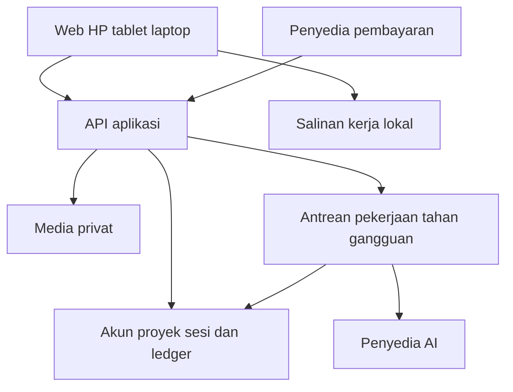

# Blueprint CeritaJadiBuku

Dokumen produk dan acuan implementasi aplikasi web pendamping menulis buku.

| Metadata | Nilai |
| --- | --- |
| Nama aplikasi | **CeritaJadiBuku** |
| Penulisan nama dalam konfigurasi | `ceritajadibuku` |
| Pemilik gagasan | Novan Andhika |
| Versi blueprint | 1.4 |
| Tanggal | 10 September 2026 |
| Sasaran pembaca | Pemilik produk, perancang pengalaman pengguna, arsitek, dan pengembang |
| Tahap | Acuan pembangunan versi pertama; belum merupakan aplikasi yang sudah diuji |

## 1 Ringkasan keputusan

CeritaJadiBuku membantu pengguna mengubah pengalaman hidup menjadi naskah melalui sesi cerita pendek, penataan bahan, penyusunan kerangka, dan penyuntingan. Pengguna tetap menentukan fakta, suara tulisan, serta bagian yang dimasukkan ke buku.

Proyek percontohan adalah kisah sekolah istri pemilik gagasan di Jepang: dari mimpi hingga terwujud, beserta perjuangan, suka duka, pertemanan, dan cinta. Tema tersebut menjadi konteks pengujian, bukan alasan mengarang detail kehidupannya.

### 1.1 Keputusan produk

| Aspek | Keputusan atau nilai awal |
| --- | --- |
| Platform | Web app responsif untuk HP, tablet, dan laptop |
| Pasar | Pengguna umum; fokus pertama memoar dan pengalaman nyata |
| Pendapatan | Langganan bulanan dan kredit AI |
| Nama | CeritaJadiBuku, ditetapkan pemilik produk |
| Cara memulai | Pilih cerita, Tulis topik sendiri, atau Langsung bercerita |
| Saran topik | Maksimal tiga pilihan sekaligus; tidak wajib dipilih |
| Lingkup wawancara | Satu momen atau bagian aktif per sesi |
| Pertanyaan | Satu pertanyaan dengan satu fokus setiap giliran |
| Batas sesi | Maksimal empat pertanyaan yang ditampilkan, termasuk pembuka dan yang dilewati |
| Berhenti lebih cepat | Bahan cukup, dua Lewati berturut-turut, Buat draf sekarang, atau Simpan dan jeda |
| Setelah draf | Tidak ada pertanyaan otomatis; menunggu tindakan pengguna |
| Refleksi cerita | Opsional; usulan utama adalah refleksi pribadi yang menyatu dengan narasi |
| Identitas tokoh | Nama asli, samaran, atau kombinasi; seluruh tokoh termasuk penulis sebagai narator boleh disamarkan |
| Nama penulis publik | Nama asli atau nama pena yang dipilih eksplisit; tidak otomatis mengambil nama akun atau tagihan |
| Tokoh belum ditinjau | Penanda sementara; Atur nanti bukan izin menerbitkan nama asli |
| Privasi naskah | Nama asli opsional dan privat; konteks AI dan ekspor memiliki pemeriksaan terpisah |
| Batas rekaman | Maksimal 10 menit per berkas, bukan per bulan atau per sesi wawancara |
| Penyimpanan | Cloud utama dengan salinan kerja lokal |
| Masa kredit tambahan | 30 hari sejak pembayaran terverifikasi; penggunaan memerlukan langganan aktif |
| Retensi setelah langganan berakhir | 15 hari sejak `paid_until` untuk baca dan ekspor |
| Paket awal | Rp79.000 per bulan, 150 kredit AI, tiga proyek, dan 1 GB per akun |
| Stack awal | Next.js, TypeScript, Tiptap, Supabase, Vercel, dan Duitku |

Nama final tidak berarti domain, nama akun media sosial, atau pendaftaran mereknya sudah tersedia. Verifikasi dilakukan sebelum pemakaian komersial identitas tersebut.

### 1.2 Cara membaca status keputusan

- **Aturan wajib** berlaku sejak prototipe, terutama batas pertanyaan, kendali penulis, isolasi akun, dan larangan tagihan ganda.
- **Nilai awal** seperti harga, kapasitas, tarif kredit, dan model AI menjadi konfigurasi awal yang dapat diuji. Perubahan untuk pengguna berbayar harus diumumkan; jangan mengubah tarif pekerjaan yang sedang berjalan.
- **Gerbang peluncuran** adalah hal yang perlu dibuktikan sebelum rilis publik, misalnya pemulihan cadangan, kebijakan penghapusan, integrasi pembayaran, dan mutu bahasa Indonesia. Gerbang ini tidak menghalangi pembangunan prototipe.

Blueprint ini menggantikan bagian framework sebelumnya yang masih memakai nama sementara, Pilih momen, atau wawancara tanpa aturan berhenti yang terukur. Dokumen ini bukan instruksi untuk membeli layanan atau memublikasikan situs sekarang.

Revisi 1.1 mengganti rancangan pembayaran ke Duitku sesuai preferensi pemilik, memperjelas durasi rekaman per berkas, dan menambahkan pilihan refleksi atau hikmah tanpa membuat wawancara wajib lebih panjang. Pengaturan refleksi merupakan rekomendasi produk yang dapat diuji bersama penulis.

Revisi 1.2 menambahkan Tokoh dan Privasi Buku: pilihan identitas per tokoh, pemetaan pribadi opsional, alur pengaturan tanpa pertanyaan tambahan otomatis, penyamaran sebelum AI, konsistensi lintas bab, pengantar sesuai perubahan nyata, serta tinjauan ekspor dan cadangan. Rujukan pelaksanaan revisi tersebut adalah `langkah-implementasi.md` versi 1.1. Revisi ini tidak mengganti harga, tarif kredit, Duitku, atau batas sesi dan rekaman.

Revisi 1.3 memasukkan hasil audit, penyamaran seluruh tokoh termasuk diri penulis dan nama pena sampul, penyusunan potongan menjadi buku, batas pekerjaan AI, pemulihan gangguan, dan hasil kajian harga serta sumber penulisan. Paket tetap Rp79.000/150 kredit; top-up 150 kredit menjadi Rp59.000 dan pekerjaan Susun bagian ditetapkan 6 kredit. Rujukan pelaksanaan pada revisi tersebut adalah `langkah-implementasi.md` versi 1.2; dasar kajian ada pada `kajian-harga-dan-penulisan.md`. Harga sebelumnya merupakan catatan historis, bukan katalog aktif.

Revisi 1.4 menetapkan masa berlaku kredit tambahan 30 hari sejak pembayaran terverifikasi dan masa baca/ekspor isi proyek 15 hari sejak `paid_until`. Jadwal pemberitahuan, konfigurasi, dan pengujian mengikuti dua batas tersebut. Rujukan aktif adalah `langkah-implementasi.md` versi 1.3 dan `kajian-harga-dan-penulisan.md` versi 1.1.

## 2 Identitas merek dan nilai produk

| Elemen | Arahan |
| --- | --- |
| Nama tampilan | CeritaJadiBuku |
| Deskripsi | Pendamping menulis pengalaman hidup menjadi buku |
| Tagline | Ceritamu, menjadi buku. |
| Kepribadian | Hangat, sabar, jelas, dan menghargai suara penulis |
| Sapaan | Kamu |
| Warna utama | Hijau gelap `#264E46` |
| Latar | Krem `#F7F3EA` |
| Aksen | Terakota `#C77856` |
| Teks utama | Gelap `#243230` |
| Arah logo | Gelembung percakapan yang menyatu dengan halaman buku |

Warna harus diuji kontrasnya pada teks dan tombol. Aksen terakota tidak otomatis menjadi latar teks kecil. Pilih tipografi yang nyaman untuk membaca panjang dan gunakan ukuran yang tetap terbaca di HP.

Produk harus membantu pengguna memulai tanpa halaman kosong yang membingungkan, mendapatkan hasil kecil setiap sesi, dan menyusun buku dari bahan yang nyata. Hindari janji buku selesai dalam hitungan menit, hasil pasti laku, atau naskah otomatis siap cetak.

## 3 Sasaran pengguna dan cakupan

### 3.1 Pengguna awal

- Orang yang ingin menulis pengalaman pendidikan, merantau, atau perjalanan karier.
- Orang tua yang ingin mendokumentasikan pengalaman dan pesan untuk keluarga.
- Orang yang memiliki cerita pribadi tetapi belum terbiasa menyusun narasi.
- Penulis pemula yang sudah memiliki catatan, rekaman, atau potongan tulisan.

Keberhasilan awal adalah pengguna menyelesaikan satu potongan tulisan yang diakui mewakili ceritanya dan ingin melanjutkan. Banyaknya kata yang dihasilkan bukan ukuran tunggal.

### 3.2 Masuk versi pertama

1. Akun dan proyek privat.
2. Pilihan cerita yang ringan serta masukan teks dan rekaman pendek.
3. Sesi dengan satu pertanyaan, Lewati, Buat draf sekarang, serta Simpan dan jeda.
4. Bank bahan asli, tokoh, linimasa, dan kerangka yang dapat dikoreksi, termasuk pilihan identitas serta samaran per tokoh.
5. Editor per bagian, draf usulan, persetujuan, dan riwayat versi.
6. Sinkronisasi antarperangkat dan penanganan konflik.
7. Langganan, pembelian kredit, riwayat pemakaian, serta pengendalian biaya.
8. Ekspor Word dengan tinjauan privasi dan nama pena, cadangan proyek dengan pilihan pemetaan identitas pribadi, serta pemulihan.
9. Penanda privasi, penghapusan proyek, dan retensi yang terukur.
10. Penataan manual serta bantuan AI untuk menyusun potongan menjadi bagian buku, dan tinjauan bagian terpilih bercakupan jelas.

### 3.3 Ditunda

Kolaborasi langsung antareditor, galeri publik, penerbitan ke marketplace, aplikasi native, percakapan suara langsung, AI lokal, penyuntingan offline penuh, fitur khusus novel dan buku akademik, serta orkestrasi tinjauan seluruh buku secara otomatis. PDF versi baca dapat ditambahkan sesudah ekspor Word stabil; tata letak cetak profesional berada di luar versi pertama.

## 4 Navigasi dan halaman utama

| Halaman | Fungsi utama |
| --- | --- |
| Beranda publik | Menjelaskan manfaat, cara kerja, harga, dan pemrosesan data |
| Buku saya | Membuat proyek, membuka buku, dan melanjutkan sesi yang dijeda |
| Ruang proyek | Ringkasan kemajuan dan akses ke cerita, kerangka, serta naskah |
| Cerita saya | Bahan asli, catatan, rekaman, dan hasil sesi |
| Sesi cerita | Satu pertanyaan atau ruang bercerita bebas |
| Peta cerita | Tokoh, linimasa, tema, dan detail belum terkonfirmasi |
| Tokoh dan Privasi Buku | Panel di ruang proyek untuk mode identitas, kartu tokoh, aturan penyamaran, dan tinjauan ekspor |
| Kerangka buku | Bab, subbab, urutan, dan fungsi setiap bagian |
| Editor | Menulis dan meninjau usulan AI pada bagian aktif |
| Kredit dan langganan | Saldo, biaya, tagihan, masa berlaku, dan pembatalan perpanjangan |
| Pengaturan | Privasi, ekspor, cadangan, penghapusan, dan bantuan |

Di laptop, daftar bab, editor, dan panel bantuan dapat tampil berdampingan. Di HP, tampilkan satu ruang kerja utama setiap saat. Tombol Kirim jawaban dan Lewati harus tetap dapat ditemukan ketika papan ketik terbuka.

Halaman pengguna tidak perlu menampilkan token, nama tabel, atau istilah teknis pemrosesan. Informasi yang wajib terlihat adalah biaya, status penyimpanan, pilihan privasi, serta tindakan berikutnya.

## 5 Memulai proyek dan memilih cerita

### 5.1 Permulaan yang ringan

Judul buku boleh sementara. Pengguna tidak wajib mengisi daftar isi, tujuan pembaca, panduan gaya, dan seluruh daftar tokoh sebelum bercerita. Mode identitas awal adalah Kombinasi; tokoh belum ditinjau menggunakan penanda sementara sesuai Bagian 7.4–7.6. Penggalian informasi tersebut dilakukan ketika membantu pekerjaan aktif, dengan tetap satu pertanyaan setiap giliran.

Jalur awal:

- **Pilih cerita:** memilih satu dari maksimal tiga saran topik.
- **Tulis topik sendiri:** memasukkan fokus singkat dengan kata-kata sendiri.
- **Langsung bercerita:** mengirim cerita tanpa pertanyaan pembuka formal.

Saran generik untuk proyek kosong dapat berupa awal sebuah mimpi, pengalaman yang membekas, atau seseorang yang penting. Jangan menampilkan banyak kategori sekaligus.

### 5.2 Saran berdasarkan konteks

Jika konteks buku Jepang sudah diberikan, saran dapat berupa Awal mimpi ke Jepang, Perjuangan mewujudkannya, dan Orang yang berkesan. Saran tidak boleh mengasumsikan kejadian seperti penolakan beasiswa bila pengguna belum menyebutkannya.

Saran dapat berasal dari katalog topik umum dan bahan yang diizinkan. Pembuatan saran tidak dipicu ulang setiap penekanan tombol atau setiap pemuatan halaman; gunakan hasil tersimpan. Biaya saran dasar masuk operasional langganan, bukan potongan kredit yang tidak diumumkan.

Memilih topik adalah navigasi. Pertanyaan substantif pertama setelah pilihan itu sudah termasuk batas empat pertanyaan. Contoh: setelah memilih Orang yang berkesan, pertanyaan Siapa yang ingin kamu ceritakan kali ini dihitung sebagai pertanyaan pertama.

Pilihan topik bukan judul bab final. Jika pengguna telah menulis fokus dan cerita dengan jelas, jangan mengulang pertanyaan pembuka yang jawabannya sudah tersedia.

## 6 Kontrak sesi cerita

### 6.1 Aturan wajib

1. Satu sesi membahas satu momen, peristiwa, adegan, atau bagian aktif.
2. Satu giliran berisi satu permintaan informasi. Satu tanda tanya tidak membuktikan bahwa pertanyaannya tunggal.
3. Tunggu Kirim jawaban atau Lewati sebelum mengajukan pertanyaan berikutnya. Autosave bukan perintah mengirim jawaban.
4. Maksimal empat pertanyaan yang ditampilkan, termasuk pembuka, klarifikasi, dan yang dilewati. Klarifikasi identitas tokoh di dalam sesi juga memakai batas ini; pengaturan tokoh tidak boleh menjadi pertanyaan tambahan otomatis.
5. Empat merupakan maksimum, bukan kuota yang harus dihabiskan. Cerita lengkap dapat langsung menghasilkan draf tanpa pertanyaan lanjutan.
6. Dua Lewati berturut-turut menghentikan penggalian. Jawaban substantif mengembalikan hitungan Lewati berturut-turut menjadi nol.
7. Jawaban kosong tidak dianggap jawaban substantif dan tidak menambah tagihan.
8. Pertanyaan yang dilewati tidak dikejar melalui redaksi lain. Detailnya boleh tetap kosong.
9. Bahan yang menarik tetapi berada di luar fokus hanya dicatat sebagai topik lain, tanpa otomatis diwawancarai.
10. Refresh, retry, pindah perangkat, dan Lanjutkan sesi tidak mengatur ulang hitungan.
11. Setelah hasil tampil, aplikasi tidak mengajukan pertanyaan baru atau otomatis membuka sesi berikutnya.
12. Memperdalam setelah sesi selesai memerlukan pilihan eksplisit pengguna dan biaya sesi baru yang terlihat.

Batas empat pertanyaan dan dua Lewati adalah parameter desain awal yang diuji pada pengguna, bukan angka berbasis penelitian yang telah terbukti.

### 6.2 Kontrol yang selalu tersedia

| Kontrol | Efek |
| --- | --- |
| Kirim jawaban | Menyimpan jawaban lalu memproses satu langkah berikutnya |
| Lewati | Menutup pertanyaan aktif tanpa meminta alasan |
| Buat draf sekarang | Mengakhiri pertanyaan dan menggunakan bahan yang sudah ada |
| Simpan dan jeda | Menyimpan keadaan tanpa memulai pertanyaan, transkripsi, ringkasan, atau draf baru |

Menyimpan rekaman yang belum ditranskripsi tidak otomatis mengirimkannya ke layanan AI. Saat pengguna memilih memproses rekaman, tampilkan biaya serta penanda privasinya.

### 6.3 Kecukupan bahan

Bahan cukup ketika inti kejadian dapat ditulis secara setia tanpa menambah fakta. Hasil boleh satu paragraf, adegan, atau catatan tertata. Tanggal persis, cuaca, pakaian, dan dialog lengkap tidak wajib jika tidak menentukan pemahaman.

AI tidak memaksa setiap cerita memiliki pelajaran hidup, rekonsiliasi, atau akhir bahagia. Ingatan yang tidak pasti tetap ditandai. Jika bahan kosong atau seluruhnya dilarang untuk AI, simpan keadaan dan tampilkan pilihan tindakan; jangan menciptakan cerita pengganti.

### 6.4 Keadaan sesi

| State | Perilaku dan jalur keluar |
| --- | --- |
| `topic_selection` | Memilih fokus; menuju masukan cerita atau pertanyaan pembuka |
| `awaiting_story` | Menunggu cerita bebas; Kirim menuju evaluasi |
| `awaiting_answer` | Satu pertanyaan aktif; menerima jawaban, Lewati, draf, atau jeda |
| `evaluating` | Menentukan satu pertanyaan relevan, draf, atau penyimpanan bahan belum cukup |
| `ready_to_draft` | Penggalian selesai; memeriksa izin biaya, bahan, kapasitas, dan akses |
| `generating_draft` | Menyusun hasil sesuai batas; tidak menampilkan pertanyaan baru |
| `draft_review` | Menampilkan hasil dan menunggu tindakan pengguna |
| `paused` | Tidak memulai pekerjaan AI; resume memulihkan state sebelumnya |
| `saved_incomplete` | Bahan tersimpan tetapi belum cukup atau belum boleh diproses |
| `blocked` | Pekerjaan tertahan karena saldo, kapasitas, akses, atau konflik; bahan tetap utuh |
| `completed` | Sesi selesai; sesi berikutnya hanya dari tindakan pengguna |

Saat pertanyaan keempat ditampilkan, aplikasi tetap menunggu jawaban, Lewati, draf, atau jeda. Penghentian karena batas berlaku setelah pertanyaan tersebut diselesaikan, bukan langsung saat muncul.

### 6.5 Data dan perlindungan terhadap balapan proses

Simpan sekurang-kurangnya `session_id`, `owner_id`, `project_id`, `session_kind`, `focus`, `state`, `resume_state`, `state_version`, `question_count`, `question_limit`, `consecutive_skips`, `current_question_id`, `interview_charge_id`, `draft_job_id`, dan `pricing_version`.

`question_limit` ditetapkan saat sesi dibuat: empat untuk sesi cerita biasa dan satu untuk sesi refleksi terpisah. Seluruh transisi memakai batas efektif ini. Pada sesi refleksi, satu Lewati sudah menutup penggalian karena batas satu pertanyaan tercapai; aturan dua Lewati pada sesi biasa tidak memaksa pertanyaan kedua muncul.

- Transisi memakai pemeriksaan `state_version` dan transaksi atomik.
- Satu pertanyaan memiliki ID stabil. Commit pertanyaan untuk ditampilkan hanya boleh satu kali; rendering ulang tidak dihitung ulang.
- Hasil AI yang datang setelah jeda atau perubahan state tidak boleh menambahkan pertanyaan atau memulai draf berikutnya.
- Jeda membatalkan pekerjaan yang masih antre. Panggilan penyedia yang sudah berlangsung mungkin tidak dapat dihentikan; biaya hasil terlambat yang tidak dipakai ditanggung aplikasi.
- Jika hasil sudah tersimpan dan tertagih sebelum jeda diproses, pertahankan hasil dan tagihan yang sah. Urutan ditentukan transaksi server, bukan waktu klik di browser.
- Pekerjaan yang ditunda karena kredit tidak boleh otomatis berjalan ketika pengguna top-up; pengguna memilih Lanjutkan.

## 7 Hasil sesi dan penyusunan buku

Setelah hasil tampil, sediakan **Edit tulisan**, **Perdalam bagian ini**, **Ceritakan momen lain**, serta **Simpan dan selesai**. Gunakan tombol, tanpa menambahkan kalimat tanya yang memulai wawancara baru.

Pisahkan tiga lapisan isi:

| Lapisan | Isi | Aturan |
| --- | --- | --- |
| Bahan asli | Jawaban, catatan, transkrip, rekaman, dan dokumen | Pertahankan sumber dan versi sampai dihapus sesuai pilihan pengguna |
| Peta cerita | Tokoh, linimasa, fakta, tema, dan ringkasan | Dapat dikoreksi; membedakan pasti, perkiraan, dan belum terkonfirmasi |
| Naskah | Potongan, subbab, bab, serta versi yang disetujui | Draf AI tidak otomatis menimpa tulisan yang disetujui |

Setiap draf menyimpan hubungan ke versi bahan asal. Ketika sumber diperbaiki, turunannya ditandai perlu ditinjau; naskah yang disetujui tidak ditulis ulang diam-diam.

Kerangka memuat judul bagian, fungsi pembahasan, batas bahasan, urutan, dan status. Beberapa potongan cerita dapat dipadukan menjadi subbab melalui usulan yang dapat ditinjau. Penggabungan tidak menghapus sumber asli.

Versi pertama menyediakan Tinjau bagian terpilih sesuai Bagian 7.12. Celah alur dan pengulangan tampil sebagai saran berdasarkan bagian yang benar-benar diperiksa. Tidak semua celah wajib diisi; aplikasi tidak memakai hasil tinjauan untuk melanjutkan wawancara otomatis atau mengklaim seluruh buku sudah diperiksa.

### 7.1 Pilihan nilai dan hikmah cerita

Penulis boleh menyampaikan makna yang ia temukan, atau cukup menceritakan kejadian dan membiarkan pembaca menafsirkannya. Tidak semua momen harus menghasilkan hikmah. Satu subbab dapat berakhir pada kejadian, perubahan suasana, atau pertanyaan batin yang belum selesai.

| Pilihan penulisan | Perilaku aplikasi |
| --- | --- |
| Cerita saja | Tidak menambahkan refleksi baru dari AI; membiarkan makna muncul melalui kejadian, tindakan, dan pilihan tokoh |
| Refleksi pribadi yang menyatu | Jika penulis memberi makna, mengolahnya menjadi bagian narasi dengan sudut pandang penulis; ini rekomendasi untuk memoar |
| Pesan lebih eksplisit | Atas pilihan penulis, membantu membuat penutup yang menyebut pelajaran atau nilai secara langsung |

Pengaturan berlaku sebagai preferensi proyek dan dapat diubah per cerita. Mengubah preferensi tidak otomatis menghapus atau menulis ulang naskah yang sudah disetujui. Semua mode tetap mempertahankan refleksi asli yang sudah disampaikan penulis sampai ia memilih menyuntingnya.

### 7.2 Kapan refleksi ditawarkan

- Jika pengguna sudah menyampaikan makna dalam jawaban, gunakan bahan itu tanpa menanyakannya lagi.
- Dalam sesi aktif, pengguna dapat memilih fokus refleksi. Pertanyaan refleksi tetap dihitung dalam batas empat, bukan menjadi pertanyaan kelima.
- Setelah hasil tampil, sediakan Tambahkan refleksi sebagai tindakan opsional pada kelompok Perdalam bagian ini. Jangan langsung mengajukan pertanyaan hanya karena satu bagian telah selesai.
- Pilihan tersebut setelah sesi selesai membuka sesi pendalaman baru dengan fokus refleksi dan plafon biaya yang terlihat. Sesi refleksi cukup satu pertanyaan; tidak perlu menghabiskan empat pertanyaan.
- Pengguna dapat memilih Lewati, Belum menemukan maknanya, atau menulis refleksi sendiri. Pilihan belum menemukan makna disimpan tanpa memaksa AI menyusun hikmah dan tanpa melanjutkan pertanyaan.

Contoh satu pertanyaan: **Apa arti pengalaman ini untukmu sekarang?**

Pisahkan makna yang dirasakan ketika kejadian berlangsung dari refleksi penulis saat mengingatnya sekarang. AI tidak boleh menulis seolah-olah tokoh sudah memahami pelajaran itu pada saat kejadian jika penulis baru menyadarinya kemudian.

### 7.3 Aturan pengolahan refleksi

Refleksi merupakan tafsir pribadi penulis, bukan fakta universal atau nasihat yang wajib diikuti pembaca. AI tidak boleh mengarang nilai, memaksakan rasa syukur atau akhir positif, dan tidak otomatis memberi bagian Hikmah pada setiap subbab. Refleksi spiritual digunakan ketika berasal dari penulis atau diminta, bukan diasumsikan untuk semua pengguna.

Simpan jawaban refleksi sebagai bahan sumber bertipe `reflection` yang mengikuti aturan privasi biasa. Usulan tulisan dapat diletakkan dalam narasi, sebagai penutup singkat, atau tetap menjadi catatan pribadi. Penyisipan memerlukan peninjauan dan persetujuan pengguna.

Refleksi yang digali dalam sesi aktif termasuk biaya sesi yang sudah diotorisasi. Pendalaman refleksi setelah sesi selesai menggunakan tarif penggalian dan draf yang sudah ada, maksimal lima kredit teks, dengan biaya ditampilkan sebelum dimulai. Refleksi manual tidak memakai kredit. Tidak ada biaya hanya untuk menampilkan tombol refleksi, memilih Lewati, atau menyatakan belum menemukan makna.

### 7.4 Tokoh dan Privasi Buku

Versi pertama menyediakan fitur **Tokoh dan Privasi Buku**. Pilihan berikut merupakan pengaturan awal proyek, dengan keputusan yang dapat berbeda untuk setiap tokoh.

| Mode buku | Perilaku |
| --- | --- |
| `real` — Nama asli | Mengusulkan nama asli untuk ditinjau; penulis tetap dapat memberi pengecualian |
| `pseudonym` — Nama samaran | Mengusulkan nama pengganti atau sebutan umum untuk tokoh |
| `mixed` — Kombinasi | Penulis memilih nama asli, samaran, atau sebutan umum per tokoh; ini pilihan awal yang disarankan |

Nama penulis di sampul boleh memakai nama asli atau nama pena. Penulis yang menceritakan dirinya sendiri juga merupakan tokoh, dengan ID narator tersendiri; ia boleh memakai nama samaran pada seluruh penyebutan identitasnya. Narasi orang pertama aku atau saya tetap dapat dipertahankan. Tidak ada pengecualian yang mewajibkan nama asli penulis. Identitas akun dan tagihan tidak menentukan nama yang terbit.

Pisahkan publication_author_name, narrator_character_id, nama tampil tokoh diri, dan identitas akun. Jangan mengambil nama akun, billing, email, atau nama operator ke sampul, biodata, ucapan terima kasih, properti Word, atau metadata ekspor secara otomatis. Nama publik yang belum dipilih boleh memakai penanda pada draf; properti penulis dokumen dikosongkan sampai ada pilihan yang sah.

Sediakan tindakan Samarkan semua tokoh, termasuk saya. Tampilkan pratinjau seluruh tokoh serta nama sampul yang masih nyata, lalu minta penerapan eksplisit. Penulis dapat memilih nama pena, alias tokoh diri, atau penanda sementara; perubahan tidak menimpa bahan asli atau naskah yang lebih baru. Mengubah mode buku saja tidak diam-diam mengganti nama sampul. Aplikasi tidak menentukan penggunaan nama asli berdasarkan label suportif, dekat, antagonis, atau memicu konflik.

Mode buku bukan izin untuk menerbitkan setiap nama yang ditemukan. Tokoh baru yang belum ditinjau berstatus `pending` dan memakai penanda sementara, misalnya `[Teman A]`. Pilihan eksplisit penulis mengubahnya menjadi `real`, `pseudonym`, atau `role`. Mengubah mode proyek tidak membatalkan keputusan per tokoh atau mengubah naskah yang sudah disetujui tanpa pratinjau dan penerapan oleh pengguna.

### 7.5 Kartu tokoh dan data pribadi

Setiap tokoh memiliki ID tetap dalam proyek, nama tampil, cara penyebutan, hubungan singkat, sebutan lain yang telah dikonfirmasi, sumber pendukung, dan status peninjauan. **Nama asli opsional.** Pengguna dapat menulis seluruh buku memakai samaran tanpa memasukkan nama asli ke aplikasi.

Pemetaan nama asli dan catatan pembicaraan mengenai penggunaan identitas disimpan pada area privat terpisah dari kartu yang dipakai untuk konteks AI dan ekspor. Lindungi dengan kontrol kepemilikan serta enkripsi yang sesuai. API kartu biasa tidak mengembalikan kolom privat tersebut; pemilik membukanya melalui tindakan khusus. Pemetaan tidak masuk log, analitik, atau akses dukungan rutin.

Catatan penggunaan nama asli dapat berstatus belum dibicarakan, sudah dibicarakan, atau ada batasan yang dicatat penulis. Catatan ini opsional, bukan bukti otomatis bahwa orang tersebut menyetujui seluruh isi atau penerbitan buku. Aplikasi tidak menghubungi orang yang diceritakan secara otomatis.

Sebutan yang sama tidak membuktikan bahwa tokohnya sama. Penggabungan kartu hanya dilakukan setelah penulis mengonfirmasi bahwa keduanya merujuk kepada orang yang sama; tampilkan pratinjau dan sediakan pemulihan. ID tokoh, alias, dan relasi sumber tidak boleh lintas proyek atau akun.

### 7.6 Alur pengaturan tanpa pertanyaan tambahan otomatis

Pengguna boleh langsung bercerita tanpa menyelesaikan daftar tokoh. Pencatatan tokoh dapat dimulai manual atau dari kandidat yang ditemukan oleh pemrosesan yang telah diizinkan; kandidat tidak menjadi fakta identitas sampai ditinjau.

Setelah draf, tampilkan tombol seperti **Tinjau 3 tokoh** tanpa langsung membuka pertanyaan. Ketika dipilih, tampilkan satu kartu dan satu pertanyaan, misalnya **Tokoh ini ingin disebut dengan nama apa di buku?** Sediakan pilihan nama asli, samaran, sebutan umum, dan **Atur nanti**. Perpindahan ke tokoh berikutnya dilakukan melalui tindakan pengguna; jangan mewawancarai seluruh daftar secara otomatis.

Atur nanti mempertahankan penanda sementara dan tidak dianggap izin menampilkan nama asli. Pengaturan ini bukan sesi pendalaman AI dan tidak memulai draf atau tagihan baru. Bila klarifikasi tokoh diajukan di dalam sesi cerita aktif, pertanyaannya termasuk batas empat dan aturan Lewati; jangan membuat pertanyaan kelima atas nama pengaturan privasi. Batas satu pertanyaan pada sesi refleksi juga tetap berlaku.

Penulis dapat kembali ke kartu tokoh kapan saja. Pengaturan identitas tidak mengharuskan pengguna mengisi alasan pribadi tentang konflik atau menghubungi pihak lain terlebih dahulu untuk melanjutkan penulisan.

### 7.7 Konsistensi nama dan perubahan lintas bab

Hubungkan penyebutan dalam naskah dengan `character_id` dan versi dokumen, bukan hanya melakukan penggantian kata bebas. Satu tokoh dapat memiliki beberapa panggilan yang telah dikonfirmasi. Dua tokoh yang berbeda tetap memiliki ID berbeda walaupun namanya sama; tawarkan nama tampil yang tidak membingungkan.

Perubahan nama tampil menghasilkan pratinjau bagian terdampak, termasuk judul, kutipan, catatan kaki, dan keterangan foto yang berupa teks. Penerapan memerlukan versi dasar yang cocok. Jika penulis telah mengubah bagian tersebut, tampilkan konflik; jangan menimpa tulisan baru. Bahan asli tidak ditulis ulang sebagai efek penggantian nama naskah.

Tandai penyebutan yang belum terhubung untuk ditinjau. Jangan mengganti bagian kata atau tokoh lain secara keliru, misalnya mengganti Budi di dalam Budiman. Relasi sebutan dan posisi teks harus diperbarui atau ditinjau ulang ketika versi isi berubah. Penggabungan kartu tidak boleh menggabungkan pengalaman dua orang yang berbeda menjadi satu tokoh komposit.

Setiap perubahan identitas atau aturan penyamaran menaikkan `privacy_revision`. Konteks antrean, cache, pratinjau, serta peninjauan ekspor versi lama menjadi tidak berlaku. Perubahan identitas tidak diam-diam menyatakan naskah lama sudah mengikuti pilihan baru.

### 7.8 Detail pengenal dan kesetiaan pada kisah nyata

Penyamaran dapat mencakup lokasi, organisasi, tanggal, jabatan, hubungan, dan detail pengenal lain. Tawaran awal adalah mengurangi ketepatan detail yang tidak menentukan substansi, dengan persetujuan penulis.

| Detail asli | Contoh usulan yang perlu ditinjau |
| --- | --- |
| Nama universitas tertentu | Sebuah universitas di Jepang |
| Tanggal kejadian persis | Pada awal semester kedua |
| Nama perusahaan | Tempatnya bekerja |
| Alamat asrama | Asrama mahasiswa tempat kami tinggal |

Jepang dapat tetap disebut karena merupakan konteks penting buku percontohan. Jangan otomatis mengubah negara, pelaku, urutan sebab-akibat, substansi dialog, atau tindakan seseorang. Mengarang kejadian, menambahkan tuduhan, dan menggabungkan beberapa orang menjadi satu tokoh bukan konsekuensi mode samaran. Simpan detail asli dan usulan penggantinya secara terpisah, beserta cakupan serta keputusan penulis.

Nama samaran tidak menjamin seseorang tidak dapat dikenali dari gabungan petunjuk atau identitas penulis yang terbuka. Sebagai rujukan teknis privasi, panduan ICO membedakan pseudonimisasi dari anonimisasi dan menjelaskan bahwa informasi tambahan dapat memungkinkan pengenalan kembali. Ini bukan klaim bahwa ketentuan hukum Inggris otomatis berlaku pada buku pengguna Indonesia. [Panduan ICO tentang pseudonimisasi](https://ico.org.uk/for-organisations/uk-gdpr-guidance-and-resources/data-sharing/anonymisation/pseudonymisation/)

### 7.9 Identitas untuk AI dan transkripsi

Pilihan nama yang tampil di buku berbeda dari data yang boleh dikirim kepada provider. Secara bawaan, konteks AI teks memakai penanda stabil khusus proyek, misalnya `[TOKOH_01]`, atau alias yang diizinkan. Penanda tidak memuat nama asli dan pemetaannya tidak dikirim ke provider. Nama tampil pilihan penulis diterapkan oleh aplikasi pada hasil yang ditinjau, termasuk bila penulis memilih nama asli untuk buku.

Urutan wajib: pilih sumber yang diizinkan, terapkan aturan identitas pada salinan konteks di aplikasi, periksa payload, lalu kirim. Pemeriksaan dasar memakai pencocokan sebutan yang telah diketahui dan aturan lokal atau server aplikasi tanpa provider AI eksternal. Nama yang belum terdeteksi tetap merupakan keterbatasan; berikan kesempatan meninjau bahan dan jangan menjanjikan seluruh identitas sudah tersamarkan.

Jangan mengirim bahan mentah beserta daftar nama asli ke AI eksternal dengan alasan meminta AI menyamarkannya. Penggunaan layanan eksternal tambahan untuk mengenali identitas bukan bagian mode dasar dan memerlukan keputusan serta penjelasan pemrosesan tersendiri. Kandidat tokoh dari AI hanya boleh berasal dari konteks yang memang boleh dikirim dan tetap memerlukan peninjauan penulis.

Pemeriksaan berlaku pada pertanyaan, ringkasan, draf, revisi, indeks, konteks turunan, dan keluaran yang disimpan. Pemetaan privat dan identitas yang dilarang tidak boleh muncul kembali pada hasil. Tolak keluaran yang melanggar, tanpa menagih hasil yang tidak dapat dipakai. `exclude_from_ai` tetap mengalahkan izin lain; mengganti nama tidak memberi izin mengirim sumber no-AI. Larangan masuk buku juga tetap berlaku.

Periksa `privacy_revision` sebelum pengiriman dan sebelum commit. Batalkan konteks antrean yang kedaluwarsa; hasil dari aturan lama tidak otomatis diterbitkan atau ditagih sebagai hasil baru yang tidak dapat dipakai. Pemulihan atau percobaan teknis mengikuti aturan job dan ledger yang sudah ada. Perubahan aturan tidak menarik kembali data yang sudah diterima provider atau hasil sah yang telah tersimpan sebelum perubahan.

**Audio berbeda:** rekaman yang menyebut nama asli akan membawa penyebutan tersebut kepada layanan transkripsi saat pengguna memilih memprosesnya. Jelaskan ini sebelum pemrosesan; sediakan pilihan menggunakan sebutan samaran sejak merekam, mengoreksi bahan melalui teks, atau menyimpan tanpa transkripsi. Penggantian nama setelah transkripsi tidak menyamarkan audio secara retroaktif. Sebelum transkrip dikirim ke AI penulisan, terapkan aturan konteks di atas. Rekaman no-AI tidak dikirim untuk transkripsi.

### 7.10 Catatan pengantar buku

Sediakan template pengantar yang dapat diedit dan diterima penulis. Isinya mengikuti perubahan yang benar-benar diterapkan pada versi naskah untuk ekspor. Bila hanya nama yang diganti, jangan menyatakan tempat atau kejadian juga telah diubah.

Contoh untuk penggantian nama saja: **Buku ini bersumber dari pengalaman penulis. Beberapa nama disamarkan untuk menjaga privasi pihak yang diceritakan.**

Contoh bila nama dan detail pengenal telah disamarkan: **Buku ini bersumber dari pengalaman penulis. Beberapa nama, tempat, dan detail pengenal disamarkan untuk menjaga privasi pihak yang diceritakan.**

Kalimat tersebut bukan jaminan bahwa tokoh pasti tidak dikenali atau bahwa semua pihak telah menyetujui seluruh cerita. Jangan otomatis menulis klaim semua pihak setuju, seluruh identitas anonim, atau semua tokoh fiktif. Pengantar tidak memuat daftar nama asli yang dipasangkan dengan samaran. Perubahan aturan atau cakupan penyamaran menandai pengantar untuk ditinjau ulang.

Mengatur kartu, memilih nama, menerapkan penggantian deterministik, meninjau privasi dasar, dan memakai template pengantar tidak menggunakan kredit AI. Bantuan menulis ulang dengan AI hanya berjalan setelah dipilih dengan cakupan dan tarif yang jelas sesuai Bagian 13; jangan menyamakan tombol Tinjau Privasi Buku dengan pekerjaan tinjauan AI berbayar.

### 7.11 Tinjau Privasi Buku sebelum ekspor

Peninjauan dasar versi pertama merupakan pemeriksaan deterministik dan peninjauan manusia. Periksa naskah, judul, daftar isi, kutipan, catatan kaki, keterangan foto, serta metadata keluaran terhadap sebutan yang diketahui dan aturan yang disetujui. Beri kesempatan memeriksa wajah, papan nama, dan tangkapan layar secara manual; OCR atau penyamaran wajah otomatis bukan prasyarat versi pertama.

Bedakan temuan yang jelas melanggar aturan dari petunjuk yang memerlukan pertimbangan. Nama yang diketahui dilarang tampil, pemetaan privat, atau materi no-book yang masih terbawa harus diselesaikan sebelum ekspor naskah. Temuan kontekstual seperti kombinasi sekolah dan angkatan ditampilkan untuk ditinjau, tanpa skor atau label pasti anonim. Tokoh `pending` dapat dipertahankan sebagai penanda sementara jika penulis meninjaunya; jangan diam-diam mengganti penanda itu dengan nama asli saat ekspor.

Ikat hasil pemeriksaan dan keputusan penulis ke snapshot versi naskah, `privacy_revision`, pilihan proyeksi ekspor, serta daftar dan versi media. Generator menggunakan snapshot yang diperiksa. Jika ada perubahan, periksa ulang bagian terdampak sebelum menghasilkan berkas. Pemeriksaan file akhir juga memastikan aturan tidak bocor melalui properti dokumen, komentar, riwayat perubahan, nama berkas, atau metadata media yang disertakan.

Ekspor naskah menggunakan daftar konten yang diizinkan, tanpa pemetaan identitas privat, catatan internal, komentar kerja, atau riwayat revisi tersembunyi. Foto asli tidak dikirim ke layanan tambahan untuk penyamaran tanpa tindakan yang sesuai. Pemeriksaan tidak menjanjikan anonimitas menyeluruh.

Selama masa hak baca dan ekspor setelah langganan berakhir, pengguna tetap dapat meninjau privasi serta memilih proyeksi nama atau detail yang lebih umum untuk berkas ekspor tanpa AI. Simpan pilihan sebagai konfigurasi ekspor; ini tidak membuka editor umum atau menulis ulang naskah cloud. Jangan memaksa perpanjangan hanya agar pengguna dapat mengunduh versi yang mengikuti aturan identitasnya.

Cadangan proyek adalah jalur berbeda dari naskah untuk pembaca. Tampilkan pilihan **Sertakan pemetaan identitas pribadi** yang secara bawaan tidak dicentang, dan simpan pilihan dalam manifest cadangan. Walaupun pemetaan terpisah tidak disertakan, sumber, versi, dan rekaman masih dapat memuat nama asli; jelaskan bahwa cadangan tersebut bukan cadangan anonim. Tetap sertakan ID tokoh, nama tampil, aturan, dan relasi yang dibutuhkan untuk pemulihan; jangan mengisi kembali nama asli yang sengaja tidak disertakan. Impor mewajibkan peninjauan baru sebelum ekspor naskah, tanpa menganggap laporan pemeriksaan lama masih berlaku.

Pilihan tidak menyertakan pemetaan berlaku pada seluruh representasi pemetaan terstruktur: kolom nama asli, pasangan asli-pengganti dalam `identity_rules`, sebutan asli sensitif dalam `character_mentions`, catatan privat, serta salinannya pada snapshot dan laporan. Bukan hanya mengecualikan satu tabel. Sertakan aturan dalam bentuk tanpa nilai asal privat, ID, nama tampil, dan referensi nonprivat yang diperlukan; bila aturan tidak lengkap setelah dipulihkan, tandai perlu ditinjau. Bahan sumber, versi bahan, dan audio mengikuti cakupan cadangan yang diumumkan dan dapat tetap mengungkap nama; jangan diam-diam membangun ulang pemetaan dari bahan tersebut saat impor.

### 7.12 Dari potongan cerita menjadi bagian buku

Versi pertama harus membuktikan bahwa beberapa momen dapat menjadi naskah yang runtut. Struktur tidak harus kronologis; penulis dapat memilih urutan waktu, tema, atau kumpulan momen. Judul, fokus, pembaca, dan benang merah boleh sementara, ditemukan setelah beberapa cerita terkumpul. Penawaran untuk meninjau fokus berupa tombol yang dipilih pengguna, bukan formulir wajib atau pertanyaan otomatis setelah draf.

Alur penyusunan:

1. Pilih dua atau lebih potongan dan bagian tujuan. Penulis dapat mengurutkan atau memindahkan potongan secara manual tanpa kredit AI.
2. Tentukan tujuan bagian dan batas bahasan dari bahan yang sudah ada; bila belum jelas, tampilkan satu pertanyaan yang dapat dilewati. Dalam wawancara aktif, pertanyaan ini tetap memakai batas sesi yang ada.
3. Untuk bantuan AI, tampilkan sumber terpilih, cakupan, dan biaya sebelum tombol Susun bagian dijalankan. Operasi assemble_section berharga 6 kredit, masukan total sampai 2.000 kata, dan hasil sampai 1.200 kata; batas ini untuk satu pekerjaan.
4. AI mengusulkan urutan, penggabungan, pengurangan pengulangan, serta transisi yang didukung sumber. Struktur tematik tidak dipaksa menjadi satu kronologi atau satu akhir bahagia.
5. Tampilkan pratinjau perubahan serta rujukan sumber per paragraf atau unit usulan. Penulis menerima, mengedit, atau menolak. Penerapan memeriksa versi seluruh bagian terdampak dan tidak menimpa perubahan baru.

Penggabungan mempertahankan fakta, ketidakpastian, serta bahan asli. Bahan no-AI dan no-book tetap mengikuti aturan yang berlaku; penyamaran tidak memberi izin tambahan. Detail yang hanya berupa dugaan atau ingatan yang tidak pasti tidak diangkat menjadi fakta. Penggabungan beberapa sumber tidak berarti semua sumber boleh disalin seluruhnya; relasi sumber mencatat unit yang benar-benar digunakan.

Jika bahan melebihi batas, pengguna memilih bagian yang lebih kecil atau menyetujui rincian beberapa pekerjaan sebelum proses. Jangan memangkas bahan atau menagih beberapa pekerjaan tanpa pilihan tersebut. Batas 800 kata tetap berlaku untuk draf sesi biasa; hasil penyusunan bagian memiliki batas 1.200 kata sendiri.

**Tinjauan versi pertama bernama Tinjau bagian terpilih.** Pengguna dapat memilih bagian yang tidak bersebelahan sampai total 5.000 kata dengan biaya 10 kredit. Tampilkan daftar bagian, versi, dan batas yang benar-benar diperiksa. Contohnya, penulis dapat membandingkan adegan di Bab 2 dengan Bab 8 selama total bahan memenuhi batas. Jangan menyatakan seluruh buku sudah diperiksa dari hasil pemeriksaan blok yang berdiri sendiri. Orkestrasi tinjauan seluruh buku secara otomatis ditunda; fitur ini membutuhkan rancangan cakupan dan harga terpisah.

Uji penerimaan: kumpulkan 6–10 momen menjadi 2–3 bab pada beberapa hari berbeda, lalu koreksi satu fakta, ganti satu samaran termasuk tokoh diri, dan temukan satu peristiwa berulang lintas bagian terpilih. Penulis dapat melanjutkan sendiri serta menjelaskan apa yang sudah atau belum diperiksa. Jumlah momen dan bab merupakan rancangan uji awal, bukan bukti ilmiah atau target wajib pengguna.

### 7.13 Prinsip penulisan dari sumber keterampilan menulis

Riset ini digunakan sebagai masukan desain untuk diuji. Nasihat penulis dan editor bukan bukti eksperimen bahwa suatu fitur aplikasi efektif. Implementasi tidak menambahkan kuisioner panjang, janji penyembuhan, atau kewajiban menemukan hikmah.

| Insight | Penerapan pada aplikasi |
| --- | --- |
| Fokus memoar dapat ditemukan melalui pemilihan pengalaman yang relevan | Fokus buku dapat diubah setelah beberapa cerita; pengguna tidak wajib menulis seluruh hidupnya |
| Adegan dan ringkasan memiliki fungsi berbeda | Gali satu detail yang menentukan pemahaman momen; ringkas penghubung tanpa mengarang detail pancaindra |
| Refleksi dapat halus dan menyisakan ruang pembaca | Bedakan yang dirasakan saat kejadian dari pemahaman sekarang; pesan moral tetap pilihan |
| Struktur dapat berbentuk kumpulan momen | Urutan kronologis dan tematik sama-sama tersedia, tanpa memaksa semua potongan memiliki transisi panjang |
| Ingatan mempunyai celah | Simpan waktu perkiraan, tingkat kepastian, dan sumber; gunakan tuturan tidak langsung ketika kata persis tidak diketahui |
| Revisi perlu menjaga suara penulis | Contoh tulisan opsional menjadi panduan; pengguna menilai apakah hasil masih terasa seperti dirinya |

Dasar fokus dan pemilihan pengalaman: [Esther Harder, Find Your Memoir's Real Story](https://janefriedman.com/stop-counting-toothbrushes-find-your-memoirs-real-story/). Dasar adegan dan refleksi: [Lisa Cooper Ellison tentang adegan](https://janefriedman.com/how-scene-writing-helps-you-lose-control-and-find-your-memoirs-story/), [tentang refleksi](https://janefriedman.com/dont-ruin-the-mystery-how-to-reflect-in-memoir-without-giving-it-all-away/).

Dasar struktur fragmen: [Beth Kephart, The Memoir in Pieces](https://creativenonfiction.org/writing/the-memoir-in-pieces/). Dasar kehati-hatian terhadap ingatan: [Ellison tentang celah ingatan](https://janefriedman.com/how-to-handle-memory-gaps-in-your-memoir/). Dasar struktur dan penyuntingan: [transkrip wawancara resmi Hester Kaplan–Marion Roach](https://marionroach.com/2026/09/how-to-write-structure-and-edit-a-memoir-with-writer-hester-kaplan/).

Yang diterapkan adalah prinsip penulisannya. Jangan mengadopsi klaim klinis atau teknik pemulihan ingatan sebagai fitur. Isi video YouTube yang transkrip atau rekamannya belum berhasil diperiksa tidak menjadi dasar perubahan spesifikasi.

### 7.14 Kecukupan bahan dan hasil yang dapat dipakai

Kecukupan dinilai terhadap fokus yang dipilih, bukan jumlah kata minimum atau kemampuan AI membuat satu paragraf. Draf pendek tetap sah ketika fokusnya sempit dan sudah terjawab; jangan memaksa panjang atau otomatis menghabiskan empat pertanyaan. Untuk cerita yang jelas belum mencakup inti fokus, gunakan sisa kesempatan menggali atau simpan sebagai bahan belum lengkap.

Pisahkan preferensi gaya dari kegagalan hasil. Usulan yang tidak sesuai selera tetapi memenuhi cakupan tetap mengikuti tarif yang telah disetujui. Kegagalan terukur mencakup fakta baru yang tidak didukung, identitas yang salah, keluaran kosong atau terpotong sehingga tidak dapat dipakai, serta hasil yang menyimpang dari pekerjaan yang diotorisasi.

Hasil tidak valid yang terdeteksi sebelum commit tidak dicapture. Perbaikan teknis memakai anggaran percobaan ulang terbatas. Bila kesalahan terverifikasi ditemukan sesudah capture, sediakan koreksi terbatas atau penyesuaian kredit tahap yang gagal, dengan referensi unik sehingga tidak dikembalikan dua kali. Tambahan cerita baru atau perubahan selera bukan alasan regenerasi gratis tanpa batas. Selama peninjauan kasus, bahan penulis dan hasil yang sudah tersedia tetap dapat dibaca sesuai haknya.

Pilot menilai kapan draf terasa terlalu cepat, jumlah koreksi yang diperlukan, dan kecocokan suara. Usulan ambang awal: median penilaian suara minimal 4 dari 5, tidak ada fakta rekaan yang belum diselesaikan dalam naskah pilot yang diterima, serta penulis dapat melanjutkan sesi pada hari berbeda tanpa arahan operator. Ini ukuran keputusan pilot, bukan jaminan AI selalu benar.

## 8 Editor dan kontrak AI

### 8.1 Tindakan editor

Tersedia penulisan manual, penataan bab, Rapikan bahasa, Ringkas, Perjelas urutan, Sesuaikan gaya, Tinjau bagian terpilih, Susun bagian dari potongan, dan Gali detail bagian ini. Bantuan berbayar dipetakan ke katalog Bagian 9.1 dan 13; tidak ada operasi AI tanpa cakupan biaya. Pengguna dapat menerima, menolak, atau mengedit usulan sebelum menerapkannya.

Setiap penerapan revisi memerlukan `base_revision_id`. Jika naskah berubah ketika AI bekerja, tampilkan konflik atau perbandingan; jangan menimpa versi baru. Undo pada editor dan pemulihan versi proyek merupakan fungsi berbeda.

Validasi isi terhadap skema dokumen Tiptap. Sanitasi HTML dan atribut dari impor, hasil AI, serta salinan pengguna. Gunakan allowlist protokol tautan dan tolak script, event handler, URL `javascript:`, serta konten aktif pada editor, preview, dan ekspor. Jangan merender HTML mentah dari model.

### 8.2 Konteks proyek

Simpan tujuan buku, pembaca, contoh suara penulis, sapaan, pilihan gaya, tokoh dan samaran, linimasa, fungsi bab, keputusan revisi, penanda privasi, dan pertanyaan yang dilewati. Data tersimpan tidak otomatis seluruhnya boleh menjadi konteks AI: pemetaan identitas privat dipisahkan, dan penyamaran diterapkan sebelum pengiriman sesuai Bagian 7.9.

Pengambilan konteks harus terbatas pada pemilik dan proyek yang benar. Perbaikan paragraf memakai paragraf terpilih dan panduan gaya. Pemeriksaan lintas bab memakai bagian asli yang relevan, bukan hanya ringkasan. Jangan mengirim seluruh buku pada setiap giliran.

### 8.3 Aturan isi

- Jangan menciptakan kejadian, percakapan, atau perasaan orang lain sebagai fakta.
- Gunakan penanda tokoh yang diizinkan; jangan menebak identitas asli, menggabungkan orang berbeda, atau mengubah substansi kisah untuk menyamarkan identitas.
- Gunakan tuturan tidak langsung ketika substansi percakapan diketahui tetapi kata-kata persisnya tidak diingat.
- Jangan mengubah ketidakpastian menjadi kepastian atau memaksa tulisan menjadi puitis.
- Cerita dan dokumen pengguna adalah bahan, bukan instruksi yang boleh mengubah aturan sistem, akses data, atau tarif.
- AI hanya mengusulkan isi. Pembuatan tagihan, penghapusan, perubahan hak akses, serta persetujuan revisi diputuskan aplikasi dan pengguna.

### 8.4 Keluaran terstruktur

Contoh kontrak evaluasi internal berikut merupakan spesifikasi, bukan respons yang ditampilkan mentah kepada pengguna:

```json
{
  "action": "ask",
  "question": {
    "text": "Apa langkah pertama yang kamu lakukan untuk mengejar keinginan itu?",
    "information_target": "first_action"
  },
  "source_ids": ["source-id"],
  "enough_for_short_draft": false
}
```

`action` hanya boleh `ask`, `draft`, atau `save_incomplete`. Pada `ask` harus ada tepat satu target informasi. Batas state tetap diperiksa server walaupun model meminta bertanya. Respons bertumpuk ditolak atau diperbaiki sebelum tampil, tanpa tagihan tambahan kepada pengguna. Pengujian semantik tetap diperlukan; pemeriksaan jumlah tanda tanya saja tidak cukup.

## 9 Penyedia AI dan transkripsi

Model awal adalah `gpt-5.6-luna` untuk wawancara, ringkasan, dan draf; `gpt-transcribe` untuk transkripsi. Simpan nama model, versi prompt, dan tarif sebagai konfigurasi server. Ketersediaan akun dan kualitas bahasa Indonesia harus diverifikasi sebelum dikunci.

Luna mendukung pengaturan reasoning `none`; gunakan untuk wawancara dan uji terhadap kualitas draf. Nama atau snapshot model tidak boleh diganti diam-diam pada pekerjaan yang sudah diotorisasi. [Dokumentasi model Luna](https://developers.openai.com/api/docs/models/gpt-5.6-luna)

Snapshot tarif yang diperiksa pada 10 September 2026:

| Layanan | Tarif rujukan |
| --- | --- |
| Luna standard short context | US$0,20 per 1 juta token masukan dan US$1,20 per 1 juta token keluaran |
| GPT Transcribe | Estimasi US$0,0045 per menit |

Tarif provider bukan harga kredit yang dijual kepada pengguna. Verifikasi ulang sebelum produksi. [Harga OpenAI API](https://developers.openai.com/api/docs/pricing)

Gunakan transkripsi rekaman dalam bahasa aslinya. Uji nama Jepang, campuran bahasa, aksen, jeda, dan suara latar. Hasil transkrip dapat dikoreksi sebelum menjadi sumber naskah. Penyebutan nama dalam audio diterima provider saat transkripsi; penggantian di hasil teks tidak berlaku retroaktif. Sebelum dipakai AI penulisan, transkrip melewati aturan identitas pada Bagian 7.9. [Panduan transkripsi](https://developers.openai.com/api/docs/guides/speech-to-text)

Batas 10 menit adalah batas satu berkas rekaman. Pengguna boleh mengirim beberapa rekaman selama kredit untuk transkripsi, kapasitas penyimpanan, dan hak langganan mencukupi. Beberapa potongan yang menjawab pertanyaan yang sama dapat dikumpulkan lalu dikirim sebagai satu jawaban; setiap potongan audio tidak membuat sesi atau hitungan pertanyaan baru. Aplikasi tidak mengajukan pertanyaan berikutnya sebelum pengguna menekan Kirim jawaban.

Usulan batas biaya teknis satu sesi teks standar adalah total 20.000 token masukan dan 4.000 token keluaran, termasuk token reasoning bila digunakan, pada pekerjaan yang berhasil. Batas ini mencakup seluruh giliran dan satu draf, bukan setiap panggilan. Sisihkan ruang keluaran untuk draf; berhenti menggali lebih cepat bila perlu. Retry teknis memiliki anggaran terpisah dan terbatas yang ditanggung aplikasi.

Jika konteks tidak muat, ambil bagian relevan atau simpan bahan untuk pekerjaan lain yang biayanya ditampilkan. Jangan memangkas naskah tanpa pemberitahuan atau memaksakan panggilan mahal di luar batas.

### 9.1 Katalog pekerjaan dan anggaran teknis

Nilai berikut menjadi batas awal yang diuji sebelum harga dikunci untuk publik. Batas token merupakan jumlah kumulatif seluruh panggilan berhasil pada operasi, termasuk prompt sistem, konteks, keluaran terstruktur, reasoning, serta ringkasan pendukung; bukan jatah untuk setiap panggilan. Batas kata berlaku pada pilihan bahan dan isi hasil untuk pengguna. Keduanya ditegakkan, dan sumber lengkap tetap disimpan ketika bahan perlu dipilih ulang.

| Operasi | Kredit | Batas bahan pengguna | Batas hasil | Token input total | Token output total |
| --- | ---: | --- | --- | ---: | ---: |
| interview | 1 per sesi | Satu fokus, maksimal empat pertanyaan | Pertanyaan dan catatan pendukung | 10.000 | 500 |
| draft | 4 | Bahan sesi atau pilihan langsung yang muat konteks | 800 kata | 10.000 | 3.500 |
| revise_selection | 2 | 1.000 kata | 1.200 kata | 8.000 | 2.500 |
| review_selection | 10 | 5.000 kata, bagian terpilih boleh tidak bersebelahan | 1.200 kata laporan bercakupan jelas | 20.000 | 3.000 |
| assemble_section | 6 | 2.000 kata dari potongan terpilih | 1.200 kata | 12.000 | 3.500 |
| transcribe | 1 per menit berhasil | Maksimal 10 menit atau 25 MB per berkas | Transkrip interval berhasil | Berdasarkan durasi | Berdasarkan durasi |

Penggalian dan draf sesi bersama-sama tetap maksimal 20.000 token input dan 4.000 token output, dengan tarif teks paling banyak lima kredit. Sesi refleksi terpisah memakai tarif sesi yang sudah ada dan hanya satu pertanyaan; draf refleksi pendek tidak harus memenuhi batas panjang maksimum.

Peta dan ringkasan yang diperlukan untuk sesi aktif termasuk anggaran tahap di atas. Pembaruan ringkasan seluruh proyek tidak dijalankan otomatis setiap simpan. Penataan manual, pencocokan nama dasar, template pembuka, template pengantar, dan pengaturan tokoh tidak memanggil provider. Bila pengguna meminta pengolahan bahan tambahan, pilih operasi yang sesuai dan tampilkan cakupan serta harganya. Pencarian web, OCR eksternal, gambar AI, embedding seluruh buku, dan tools berbayar lain tidak termasuk katalog ini.

Percobaan ulang maksimal dua kali tambahan per tahap. Total token input tambahan dan total token output tambahan masing-masing paling banyak satu kali anggaran jenis token yang sama pada tahap asal; anggaran input tidak dapat dialihkan menjadi output. Batas waktu reservasi tetap berlaku. Untuk audio, total durasi pemrosesan tambahan paling banyak durasi sumber asli yang diotorisasi. Dua kesempatan tambahan tidak berarti dua kali anggaran penuh tambahan. Batas ini berlaku juga pada perbaikan keluaran tidak valid; bagian yang berhasil tidak ditagih ulang.

Pencatatan biaya provider mencakup sukses, gagal, unknown, pembatalan terlambat, koreksi tanpa biaya pengguna, dan operasi pendukung. Terapkan anggaran kegagalan per akun serta global, alarm dan pemutus sementara operasi baru ketika layanan bermasalah. Nilai produksi wajib ditetapkan dari hasil pilot dan kemampuan anggaran pemilik sebelum rilis; mode uji menggunakan nilai eksplisit yang tercatat. Jangan mengandalkan saldo kredit sebagai satu-satunya pembatas biaya provider, karena proses gagal tetap dapat menimbulkan biaya.

Penghentian karena gangguan ditampilkan sebagai status layanan dengan bahan tetap tersimpan, tanpa potongan tahap yang tidak menghasilkan keluaran. Ini bukan jatah harian baru yang disembunyikan dari pelanggan. Batas anggaran komersial dan pembelian kapasitas tambahan diperiksa operator; hasil valid yang sudah dibayar tidak dihapus. Tidak ada fallback ke model lebih mahal secara diam-diam; perubahan model memerlukan pengujian ulang mutu, batas operasi, dan ekonomi.

## 10 Privasi dan penggunaan data

### 10.1 Perlindungan proyek

Semua proyek privat secara default. Terapkan pemeriksaan kepemilikan di server, Row Level Security pada data, bucket media privat, serta URL akses berumur pendek. Kunci penyedia AI, service role, dan kredensial pembayaran tidak dikirim ke browser.

Gunakan enkripsi saat pengiriman dan penyimpanan. Jangan menyebut produk memiliki enkripsi ujung ke ujung jika server dapat membaca teks untuk AI. Penyimpanan cloud dan pemrosesan penyedia AI harus dijelaskan pada pengguna.

### 10.2 Dua penanda berbeda

| Penanda | Arti dan penegakan |
| --- | --- |
| `exclude_from_book` | Bahan tidak boleh masuk draf atau ekspor naskah. Pemakaian sebagai konteks AI membutuhkan izin terpisah `allow_ai_context` |
| `exclude_from_ai` | Tidak boleh dikirim untuk pertanyaan, draf, ringkasan, transkripsi, embedding, evaluasi, atau layanan eksternal lain yang memproses isi |

`exclude_from_ai` mengalahkan izin konteks. Penanda tersebut tidak berarti data hanya tersimpan di perangkat; data masih dapat berada di cloud aplikasi.

Larangan berlaku pada sumber dan seluruh turunan yang mengungkap isinya. Simpan hubungan asal. Perubahan no-AI membatalkan konteks antrean dan mengecualikan ringkasan, catatan tokoh, indeks, atau draf turunan dari pemrosesan AI berikutnya sampai dibangun ulang dari bahan yang diizinkan. Penanda no-AI tidak melarang pemilik membaca, mengedit manual, atau mengekspor tulisannya sendiri. Periksa kembali izin sebelum pengiriman ke provider dan sebelum commit hasil.

Sebaliknya, no-book memblokir ekspor naskah yang masih memuat sumber tersebut, termasuk bagian yang sudah disetujui, sampai isinya dibersihkan atau penandanya diubah pengguna. Pemilik dapat meninjau bagian yang terdampak; aplikasi tidak menghapusnya diam-diam. Cadangan proyek lengkap tetap merupakan jalur terpisah yang dapat memuat bahan pribadi sesuai pilihan pemilik.

Untuk larangan masuk buku, prompt saja bukan jaminan. Konteks terlarang diberi klasifikasi terpisah, hasil diperiksa, dan sumber ditampilkan untuk peninjauan. Bila keterpisahan tidak dapat dipastikan, keluarkan bahan itu dari konteks generasi sejak awal. Jangan otomatis memublikasikan hasil.

Pemilihan nama samaran tidak mengubah kedua penanda tersebut. Pemetaan identitas privat, alias yang bersumber dari bahan no-AI, serta turunan lain tetap mengikuti penelusuran sumber; sumber terlarang tidak boleh dikirim hanya karena namanya sudah diganti.

### 10.3 Kebijakan penyedia

Data OpenAI API tidak digunakan untuk pelatihan kecuali opt-in. Log pemantauan penyalahgunaan secara default dapat disimpan hingga 30 hari dengan pengecualian tertentu. Gunakan `store=false` untuk menghindari penyimpanan response state biasa; ini tidak menghapus seluruh kemungkinan retensi. Endpoint transkripsi memiliki ketentuan retensi tersendiri. Jangan menjanjikan zero retention otomatis. [Kontrol data OpenAI](https://developers.openai.com/api/docs/guides/your-data)

Jangan mengaktifkan penggunaan naskah untuk pelatihan atau evaluasi eksternal secara default. Jangan mengganti penyedia AI tanpa pemberitahuan yang sesuai. Model pembanding diuji memakai bahan yang memang diizinkan.

Perubahan penanda hari ini tidak menarik kembali data yang telah diproses penyedia. Hindari pencatatan prompt atau naskah mentah di log, alat analitik, pelacak error, dan rekaman sesi browser.

## 11 Kapasitas penyimpanan dan sinkronisasi

### 11.1 Kuota paket

| Komponen | Nilai awal |
| --- | --- |
| Proyek | 3, termasuk arsip dan proyek di sampah sampai dihapus permanen |
| Kuota akun | 1 GB = 1.000.000.000 byte |
| Isi kuota | Naskah, bahan, media, dan riwayat versi yang tersimpan |
| Naskah per buku | Maksimal 150.000 kata; bukan sasaran panjang tulisan |
| Audio per berkas | Maksimal 10 menit atau 25 MB, mana yang lebih dahulu |
| Foto per berkas | Maksimal 10 MB |
| Dokumen per berkas | Maksimal 20 MB |
| Versi otomatis | 30 hari; revisi aktif dan sumber yang masih digunakan tidak dihapus karena umur versi |

Tidak ada jatah rekaman hanya 10 menit per bulan. Batas durasi berlaku **per berkas**, sedangkan batas pemakaian bulanan ditentukan saldo kredit yang digunakan untuk transkripsi dan pekerjaan teks. Rekaman tersimpan memakai kuota 1 GB sampai dihapus. Menghapus audio tidak mengembalikan biaya transkripsi yang sudah berhasil diproses, tetapi pengguna dapat mempertahankan transkripnya.

Contoh: satu rekaman 10 menit memakai 10 kredit jika seluruhnya berhasil ditranskripsi. Jika dilanjutkan dengan satu sesi teks lengkap, totalnya paling banyak 15 kredit. Jika seluruh 150 kredit bulanan dipakai untuk transkripsi saja, jumlahnya setara 150 menit; ini contoh alokasi saldo, bukan tambahan kuota audio gratis. Pemakaian draf, tinjauan, dan pekerjaan lain mengurangi saldo yang sama. Untuk rekaman lebih panjang dari batas per berkas, bagi menjadi beberapa berkas tanpa mengulang wawancara.

Cadangan operasional perusahaan dan hasil ekspor sementara tidak dibebankan sebagai kuota tersembunyi kepada pengguna. Versi otomatis yang tidak lagi dipakai dapat dipadatkan; bahan asal draf yang masih dipertahankan tetap tersedia atau disalin sebagai snapshot sumber yang jelas.

Reservasi kapasitas dilakukan sebelum unggahan dan sebelum AI menghasilkan versi baru. Browser mengirim berkas langsung ke storage privat memakai izin terbatas yang terikat pemilik, objek, dan tenggat. API aplikasi membuat upload intent serta memfinalisasi objek setelah ukuran, jenis, checksum, dan durasi diperiksa server. Status belum tervalidasi tidak dapat diproses AI. Nama berkas bukan path tepercaya; batasi dekompresi dan bersihkan unggahan gagal atau yatim sambil melepas reservasi.

Gunakan unggahan yang dapat dilanjutkan pada berkas besar atau koneksi tidak stabil. Jangan mem-proxy payload audio 25 MB atau cadangan besar melalui body Vercel Function; batas request/response fungsi adalah 4,5 MB. Worker membuat ekspor/cadangan besar di storage dan pengguna mengunduh melalui URL sementara. Uji berkas 25 MB dan unduhan lebih dari 4,5 MB pada staging, termasuk koneksi terputus. [Batas Vercel Functions](https://vercel.com/docs/functions/limitations#request-body-size), [Unggahan resumable Supabase](https://supabase.com/docs/guides/storage/uploads/resumable-uploads)

Saat penuh, tetap izinkan baca, unduh, pembersihan media, dan penghapusan. Jangan menagih draf yang gagal disimpan karena kapasitas. Jangan menghapus naskah otomatis untuk menyediakan tempat.

### 11.2 Sinkronisasi

Database cloud menyimpan versi yang diterima server. IndexedDB menjadi salinan kerja serta antrean perubahan lokal, bukan bukti data sudah tercadangkan.

- Setiap penyimpanan mengirim versi dasar dan kunci idempoten.
- Versi yang cocok dapat disimpan; versi konflik menghasilkan perbandingan atau salinan konflik.
- Tampilkan Tersimpan di perangkat, Menyinkronkan, Tersinkron, atau Sinkronisasi gagal.
- Sesi yang sama dibuka di dua perangkat tetap memakai satu penghitung server.
- Logout membersihkan salinan akun dengan memperingatkan perubahan yang belum tersinkron. Jangan menampilkan draf akun sebelumnya pada akun berikutnya.
- Penyuntingan offline penuh belum dijanjikan. Saat koneksi hilang, simpan perubahan secara lokal bila tersedia dan jelaskan bahwa AI daring tidak dapat dipakai.

### 11.3 Cadangan

Ekspor Word berisi naskah yang telah melalui pemeriksaan Bagian 7.11, tanpa pemetaan identitas privat atau riwayat kerja tersembunyi. Cadangan proyek berisi struktur, sumber, versi relevan, dan media untuk pemulihan. Pilihan menyertakan pemetaan identitas pribadi secara bawaan tidak dicentang. Sumber dan audio dalam cadangan tetap mungkin memuat nama asli meskipun pemetaan terpisah tidak disertakan; beri informasi tersebut sebelum diunduh. Manifest mencatat cakupan cadangan; ID tokoh, nama tampil, dan relasi tetap dapat dipulihkan tanpa nama asli.

Pemulihan memeriksa versi format, checksum, ukuran total, serta pemilik baru. Jangan mengimpor ID kepemilikan atau saldo kredit dari berkas cadangan. Jika belum berlangganan atau kuota tidak cukup, pengguna masih dapat mengunduh berkas yang dimiliki tetapi pemulihan ke cloud menunggu hak akses yang sesuai.

### 11.4 Pemulihan operasional layanan

Cadangan proyek pengguna dan pemulihan layanan adalah dua pengujian berbeda. Layanan menyimpan cadangan database serta media setidaknya harian, dengan manifest yang menghubungkan snapshot database ke versi objek yang dapat dipulihkan. Objek berversi tidak ditimpa tanpa jejak. Target rekayasa awal kehilangan data maksimal 24 jam (RPO) dan pemulihan maksimal 24 jam (RTO) harus dibuktikan dalam latihan sebelum rilis berbayar; jangan menjadikannya jaminan nol kehilangan data.

Latihan memulihkan database, media, identitas, ledger, dan status job sebagai satu layanan. Penanda penghapusan minimal harus tetap tersedia walaupun database dipulihkan ke versi lama, melalui jurnal terisolasi yang mengikuti kebijakan retensi; terapkan jurnal sebelum akses dibuka kembali. Job dan hak pembayaran yang meragukan ditahan lalu direkonsiliasi dengan bukti provider. Jangan otomatis mengulang panggilan AI atau pemberian kredit dari antrean yang kembali hidup setelah restore. Rekonsiliasi Duitku tetap terbatas, bukan polling agresif.

Keberhasilan impor cadangan pengguna tidak menggantikan latihan ini. Keharusan mengunduh cadangan sendiri tidak boleh dijadikan pengganti tanggung jawab operasional aplikasi. Jika biaya atau konfigurasi belum dapat memenuhi target, perbaiki rancangan dan ulangi latihan sebelum menjanjikan layanan publik.

## 12 Langganan dan harga awal

| Produk | Harga | Isi |
| --- | --- | --- |
| Paket Menulis | Rp79.000 per bulan | 150 kredit, 3 proyek, 1 GB, editor, sinkronisasi, versi, dan ekspor |
| Kredit tambahan kecil | Rp29.000 | 50 kredit |
| Kredit tambahan besar | Rp59.000 | 150 kredit |

Satu bulan berarti satu bulan kalender pada jangkar tagihan pengguna, bukan selalu 30 hari. Simpan waktu dalam UTC dan tampilkan menurut Asia/Jakarta untuk peluncuran Indonesia. Untuk tanggal yang tidak ada pada bulan berikutnya, gunakan hari terakhir bulan itu dengan mempertahankan jangkar awal untuk bulan selanjutnya.

Pembayaran awal membuka periode sejak pembayaran terverifikasi. Perpanjangan saat aktif menambah periode dari akhir hak berjalan; kredit periode berikutnya diberikan ketika periode tersebut dimulai, bukan saat pembayaran awal diterima. Jika telah nonaktif, periode baru dimulai dari aktivasi pembayaran. Aturan ini harus memiliki tes untuk akhir bulan.

Tidak ada komitmen tahunan atau trial otomatis dalam versi awal. Uji terbatas dapat menggunakan akses tester dengan batas yang ditentukan pemilik produk, terpisah dari paket publik.

Menulis manual, mengatur bab, membaca, menerima revisi, dan ekspor tidak memakai kredit AI. Pengaturan tokoh, penggantian deterministik, tinjauan privasi dasar, dan template pengantar juga tidak memakai kredit. Bantuan penulisan ulang dengan AI tetap mengikuti tindakan dan tarif yang disetujui pada Bagian 13. Saldo nol tidak menghilangkan hak editor selama langganan masih aktif.

## 13 Tarif pekerjaan dan penagihan kredit

### 13.1 Tarif yang dilihat pengguna

| Pekerjaan | Tarif | Cakupan |
| --- | --- | --- |
| Penggalian satu momen | 1 kredit | Sekali per sesi, maksimal empat pertanyaan |
| Hasil draf sesi | 4 kredit | Hasil sampai 800 kata sesuai bahan |
| Langsung draf | 4 kredit | Tanpa biaya penggalian bila tidak ada tahap wawancara AI |
| Rapikan tulisan | 2 kredit | Masukan sampai 1.000 kata |
| Tinjau bagian terpilih | 10 kredit | Masukan sampai 5.000 kata; cakupan bagian diperlihatkan |
| Susun bagian dari potongan | 6 kredit | Masukan total sampai 2.000 kata; keluaran sampai 1.200 kata |
| Transkripsi | 1 kredit per menit | Durasi berhasil diproses; terpisah dari teks |

Satu sesi teks lengkap paling banyak lima kredit. Audio dihitung terpisah. Nilai 800 kata adalah batas keluaran, sedangkan 1.000 dan 5.000 kata adalah batas masukan. Pekerjaan di luar batas dipecah dengan rincian biaya sebelum dijalankan, bukan ditagih di belakang layar.

Penggalian ditagih sekali ketika bahan substantif pertama berhasil diproses AI pada jalur wawancara. Sekadar membuka sesi atau melewati pertanyaan tanpa cerita tidak ditagih. Draf ditagih ketika hasil yang dapat digunakan sudah tersimpan dan tersedia, bukan hanya saat permintaan dikirim.

Sesi yang dijeda tidak memulai biaya tahap berikutnya. Jika satu kredit penggalian telah sah ditagih, melanjutkan sesi yang sama tidak menagihnya lagi. Draf yang memenuhi pekerjaan tetap berbayar walau pengguna menolak gaya tulisannya. Kegagalan terukur dan koreksi atau penyesuaian tahap mengikuti Bagian 7.14; jangan menyamakan fakta rekaan atau identitas salah dengan sekadar ketidakcocokan gaya.

### 13.2 Izin biaya dan batas penggunaan

Sebelum sesi, tampilkan plafon lima kredit untuk teks dan biaya transkripsi terpisah. Memulai sesi dengan plafon tersebut mengizinkan draf otomatis saat bahan cukup. Jangan meminta persetujuan biaya berulang di setiap jawaban. Bila tindakan baru melampaui plafon atau memakai tarif baru, minta pilihan eksplisit melalui tombol dengan harga.

Batasi satu pekerjaan AI aktif per akun. Terapkan pembatasan frekuensi teknis untuk penyalahgunaan tanpa menyembunyikan kuota harian baru dari pengguna. Tidak ada saldo negatif atau pembelian otomatis. Retry internal dibatasi dan biayanya ditanggung aplikasi.

### 13.3 Satuan saldo dan masa berlaku

Gunakan bilangan bulat, bukan floating point: **1 kredit = 60.000 unit internal**. Pada tarif transkripsi satu kredit per menit, satu milidetik audio berhasil setara satu unit. Pengukuran durasi dilakukan server, dan potongan teknis yang diproses ulang tidak dihitung dua kali. Tampilan dapat membulatkan saldo, tetapi ledger menyimpan nilai tepat.

Reservasi transkripsi memakai durasi berkas terverifikasi. Pemrosesan parsial memakai chunk_id stabil, checksum sumber, rentang waktu sumber, dan status tiap potongan. Capture durasi gabungan interval unik yang berhasil, bukan perkiraan dari panjang teks. Potongan ulang atau overlap tidak menambah durasi dua kali; waktu tambahan untuk konteks pemrosesan ditanggung aplikasi.

Jeda normal di dalam potongan berbicara yang berhasil tetap termasuk durasi pemrosesan. Potongan sepenuhnya senyap, hasil kosong/tidak valid, atau gagal tidak ditagih. Jika hanya sebagian berhasil, tampilkan rentang serta biaya, lalu lepaskan reservasi sisanya. Contoh: dari 10 menit, interval 0–5 menit berhasil dan 5–10 menit gagal: capture lima kredit; mencoba kembali interval gagal tidak menagih interval pertama. Perilaku senyap dan deteksi keluaran rekaan harus diuji pada provider, bukan disimpulkan hanya dari jumlah kata.

| Jenis saldo | Masa berlaku |
| --- | --- |
| Kredit bulanan | Sampai akhir periode asal, tidak rollover |
| Kredit tambahan | 30 hari sejak pembayaran terverifikasi |

Untuk kredit tambahan, 30 hari berarti tepat 30 × 24 jam: `expires_at = granted_at + 30 hari`, dengan `granted_at` ditetapkan sekali dari pembayaran yang pertama kali terverifikasi. Simpan waktu UTC dan tampilkan tanggal serta jam kedaluwarsa menurut Asia/Jakarta. Callback atau rekonsiliasi ulang tidak mengubah awal masa berlaku. Ini berbeda dari periode langganan satu bulan kalender. Tampilkan masa berlaku sebelum pembelian dan tanggal kedaluwarsa setiap lot pada saldo.

Gunakan lot yang paling cepat kedaluwarsa lebih dulu. Top-up tidak memperpanjang usia lot sebelumnya. Saat langganan nonaktif, masa berlaku kredit tambahan terus berjalan dan penggunaan memerlukan langganan aktif. Kredit bukan janji bahwa proyek terus disimpan melewati masa retensinya.

### 13.4 Ledger dan reservasi

Alur pekerjaan berbayar: **otorisasi hak dan biaya, reservasi saldo, eksekusi, simpan hasil, lalu capture**.

1. Server menentukan harga dari jenis pekerjaan dan versi tarif, bukan dari nominal yang dikirim browser.
2. Reservasi dan pengalokasian lot bersifat atomik sehingga dua permintaan tidak menghabiskan saldo yang sama.
3. Reservasi teks hanya mencakup tahap yang akan berjalan; sesi panjang tidak menahan saldo tanpa batas selama pengguna mengetik.
4. Setiap reservasi memiliki batas waktu pendek sesuai pekerjaan, dengan batas awal maksimal 15 menit. Pekerjaan yang tidak selesai ditangani rekonsiliasi; jangan menjalankan duplikat ketika hasil timeout belum diketahui.
5. Commit referensi hasil yang dapat diakses, status sukses job, capture ledger, serta penanda tagihan sesi dilakukan dalam satu transaksi database, dengan `job_id` dan kunci unik. Berkas besar dapat diunggah ke staging privat sebelumnya. Hasil belum dianggap tersedia sampai transaksi berhasil. Koneksi klien terputus tidak membatalkan pekerjaan yang sudah sah selesai.
6. Kegagalan tanpa hasil melepaskan reservasi. Unit tersedia dan unit terpesan dicatat terpisah: expiry mengakhiri unit tersedia yang tidak dicadangkan. Reservasi yang sah dapat dicapture dari lot asal sesudah lot kedaluwarsa sampai tenggat reservasinya, tanpa mengambil lot bulan baru. Release sesudah expiry menjadikan unit kedaluwarsa, tidak menghidupkan saldo. Uji reservasi pukul 23.59, expiry pukul 00.00, dan capture atau release pukul 00.01 secara bersamaan.
7. Pekerjaan yang diotorisasi saat langganan aktif dapat selesai dalam tenggat reservasinya meski periode berakhir. Pekerjaan baru tetap memerlukan hak aktif.
8. Jeda, retry, atau pembukaan hasil tidak memotong kredit lagi. Regenerasi atas permintaan baru merupakan pekerjaan baru.
9. Refund, reversal, atau koreksi dibuat sebagai entri penyesuaian, tanpa menghapus sejarah ledger.

Sebelum draf, pastikan saldo yang masih berlaku dan ruang hasil tersedia. Jika saldo tidak cukup, simpan bahan serta state `blocked`; lanjut hanya sesudah pengguna memilih tindakan. Jangan mengulang seluruh wawancara.

## 14 Pembayaran dengan Duitku

Gunakan **Duitku POP** sebagai rancangan awal untuk tagihan bulanan dan kredit tambahan, mengikuti preferensi pemilik produk. Mulai dengan halaman pembayaran melalui redirect `paymentUrl`; popup dapat ditambahkan setelah diuji pada perangkat sasaran. QRIS, virtual account, kartu, dan e-wallet hanya ditampilkan sesuai kanal yang aktif serta disetujui untuk merchant. [Dokumentasi Duitku POP](https://docs.duitku.com/pop/id/)

Tarif publik yang diperiksa pada 10 September 2026 adalah QRIS 0,7%; virtual account Artha Graha atau Sahabat Sampoerna Rp1.500, Mandiri Rp4.000, BCA Rp5.000, dan VA lainnya Rp3.000 per transaksi. Halaman harga menyatakan tarif termasuk PPN; beberapa e-wallet memiliki kategori tarif produk digital tersendiri. Harga dan kanal akhir diverifikasi pada akun merchant sebelum peluncuran. [Harga Duitku](https://www.duitku.com/harga/)

Versi pertama tetap memakai perpanjangan manual melalui invoice dan pengingat. Dokumentasi Duitku menyebut dukungan token kartu untuk transaksi berulang; kelayakan akun, izin pengguna, serta kanalnya harus diverifikasi sebelum mengaktifkan autodebit. Jangan menganggap QRIS atau virtual account dapat mendebit otomatis hanya karena produk memakai model langganan. [Fitur kartu Duitku POP](https://docs.duitku.com/pop/id/#credit-card-detail)

### 14.1 Alur pembayaran yang wajib

- Server membuat invoice dari katalog harga yang berlaku dan menyimpan pemilik serta produk.
- Return URL dan callback JavaScript pada browser hanya membuka atau memperbarui tampilan status, tidak memberikan hak atau saldo.
- Callback server Duitku memerlukan verifikasi signature sesuai versi API POP yang dipakai, serta pencocokan merchant, `merchantOrderId`, nominal, mata uang yang berlaku, referensi, dan status transaksi. Dokumentasi terbaru memakai HMAC SHA256; jangan menyalin rumus SHA256 atau MD5 versi lama tanpa memastikan kompatibilitasnya.
- Satu invoice hanya memiliki satu grant hak atau kredit. Webhook berulang dan status yang datang tidak berurutan harus aman.
- Invoice pending, gagal, atau kedaluwarsa tidak menambah saldo. Pembayaran yang statusnya berubah memerlukan rekonsiliasi dari bukti penyedia.
- Refund atau chargeback membuat penyesuaian ledger dan peninjauan hak terkait setelah ada bukti penyelesaian dari provider atau merchant. Jangan mengasumsikan refund tersedia sebagai API otomatis; jalur refund merchant diverifikasi sebelum diumumkan. Naskah tidak langsung dihapus karena sengketa pembayaran.
- Pengingat perpanjangan berhenti setelah pembayaran sukses. Pembatalan perpanjangan tidak mengakhiri periode yang telah dibayar.

Gunakan API cek transaksi untuk verifikasi atau rekonsiliasi terbatas yang dipicu kejadian dan tindakan admin. Dokumentasi memperingatkan terhadap pemanggilan otomatis berulang; jangan menerapkan polling cron agresif ke Duitku. Validasi format request, signature, respons, dan batas panggilan melalui sandbox. Pemeriksaan job dan ledger lokal tetap dapat dijadwalkan tanpa harus memanggil provider setiap kali. [Cek transaksi Duitku](https://docs.duitku.com/api/id/#cek-transaksi)

## 15 Retensi penghapusan dan dukungan

### 15.1 Langganan berakhir

| Waktu atau tindakan | Perilaku |
| --- | --- |
| Pengguna membatalkan perpanjangan | Hak tetap aktif sampai `paid_until` |
| `paid_until` tercapai | Mode baca dan ekspor dimulai; editor cloud dan AI baru tidak aktif; tinjauan serta proyeksi privasi ekspor tetap tersedia sesuai Bagian 7.11 |
| 15 hari setelah `paid_until` | Masa retensi isi berakhir pada `retention_ends_at = paid_until + 15 × 24 jam` |
| Saat `paid_until`, lalu H-7 dan H-1 sebelum `retention_ends_at` | Pemberitahuan batas baca/ekspor dan penghapusan, dengan tanggal serta jam akhir yang jelas |
| Berlangganan kembali sebelum retensi berakhir | Membatalkan penghapusan terjadwal yang belum dimulai |
| Sesudah retensi | Isi tidak lagi tersedia; penghapusan produksi selesai maksimal 7 hari kemudian |
| Sesudah penghapusan produksi aktual | Cadangan terkait kedaluwarsa maksimal 30 hari kemudian |

Masa 15 hari dihitung sebagai durasi tepat dalam UTC sejak `paid_until`; tanggal dan jam akhir ditampilkan menurut Asia/Jakarta. Pada atau setelah `retention_ends_at`, hak baca/ekspor isi lama berakhir dan penghapusan dipicu. Hitungan retensi bukan dimulai saat tombol batal ditekan. Pembayaran pada atau setelah deadline 15 hari tidak membatalkan purge proyek lama meskipun penghapusan fisik belum selesai. Informasi ini ditampilkan sebelum checkout. Pengguna dapat mengimpor cadangan yang dimiliki sebagai proyek baru; pembayaran tidak menjamin pemulihan isi lama.

Retensi isi meliputi naskah, media, transkrip, ringkasan, indeks, versi, konteks pekerjaan, dan ekspor sementara, termasuk kartu tokoh, pemetaan identitas privat, sebutan, aturan penyamaran, serta laporan tinjauan privasi. Memindahkan proyek ke sampah tidak memperpanjang `retention_ends_at`; gunakan tenggat penghapusan yang lebih awal bila keduanya berlaku. Data identitas proyek tidak dipertahankan sebagai metadata langganan atau arsip keuangan. Akun minimal dan ledger kredit tambahan yang masih berlaku dipisahkan dari penghapusan proyek. Durasi arsip transaksi keuangan harus ditetapkan sebelum peluncuran; jangan menyimpan naskah di arsip transaksi tersebut.

### 15.2 Hapus proyek dan hapus akun

Hapus proyek biasa memindahkan proyek ke sampah selama 7 hari agar dapat dipulihkan; pemilik dapat memilih hapus permanen lebih cepat. Sesudah masa sampah berakhir atau hapus permanen dipilih, akses dicabut dan penghapusan produksi selesai maksimal 7 hari kemudian. Cadangan kedaluwarsa maksimal 30 hari setelah penghapusan produksi aktual. Sampah tetap memakai slot dan kapasitas sampai penghapusan produksi dikonfirmasi. Untuk hapus permanen, target operasional normal pengosongan adalah maksimal 15 menit; tujuh hari merupakan batas penyelesaian ketika terjadi gangguan, bukan waktu tunggu normal. Tampilkan status, pantau keterlambatan, dan eskalasi jika target terlewati; jangan membebaskan slot sebelum data utama benar-benar dihapus.

Hapus akun eksplisit langsung memulai proses penghapusan tanpa menunggu retensi 15 hari. Sebelum konfirmasi, tampilkan dampak terhadap seluruh proyek dan saldo, serta akses ekspor. Penghapusan produksi selesai maksimal 7 hari; cadangan maksimal 30 hari setelahnya. Perlakuan refund atau penghangusan sisa kredit harus ditetapkan dan ditampilkan sebelum fitur penghapusan akun dipublikasikan; jangan membuat keputusan komersial itu secara tersembunyi dalam kode.

Permintaan penghapusan menyimpan penanda penghapusan minimal agar pemulihan cadangan tidak menghidupkan kembali isi yang sudah dihapus. Pekerjaan tertunda dibatalkan, URL media dicabut bila memungkinkan, dan cache server dibersihkan. Cache perangkat dibersihkan saat perangkat kembali terhubung; aplikasi tidak dapat menarik kembali berkas yang telah diunduh pengguna.

Batas 7 dan 30 hari adalah persyaratan produk yang harus dibuktikan oleh konfigurasi cadangan, bukan kemampuan otomatis semua provider. Retensi provider AI dijelaskan terpisah.

### 15.3 Email transaksional dan dukungan

Konfigurasikan SMTP produksi atau layanan pengiriman yang sesuai untuk verifikasi akun dan pemulihan sandi, dengan domain pengirim serta SPF, DKIM, dan DMARC yang teruji. Supabase SMTP bawaan hanya untuk pengujian terbatas dan tidak mencukupi pengguna umum; uji pengiriman ke alamat di luar tim proyek. [SMTP Supabase](https://supabase.com/docs/guides/auth/auth-smtp)

Pengingat langganan dan retensi dikirim oleh antrean email aplikasi yang terpisah dari autentikasi, dengan deduplikasi, percobaan ulang terbatas, dan catatan status tanpa naskah pribadi. Uji alamat gagal, pengiriman terlambat, serta pembatalan pengingat ketika hak berubah. Jangan menonaktifkan verifikasi akun untuk menutupi konfigurasi email yang belum siap.

Email atau formulir aplikasi menjadi jalur utama. Target respons pertama maksimal dua hari kerja. Masalah akses naskah dan pembayaran diprioritaskan. Dukungan 24 jam dan konsultasi pribadi menulis tidak termasuk paket awal.

Staf dukungan melihat metadata minimum. Akses isi proyek untuk diagnosis memerlukan persetujuan pemilik yang terbatas tujuan dan durasi, dengan catatan audit; tidak diberikan otomatis ke seluruh staf.

## 16 Arsitektur sistem

### 16.1 Stack awal

| Komponen | Pilihan | Tanggung jawab |
| --- | --- | --- |
| Antarmuka dan API aplikasi | Next.js dan TypeScript | Editor, sesi, autentikasi permintaan, kontrak API |
| Editor | Tiptap open source | Dokumen terstruktur dan antarmuka penyuntingan |
| Data akun dan proyek | Supabase Auth dan PostgreSQL | Identitas, kepemilikan, versi, session state, transaksi |
| Media | Supabase Storage privat | Audio, foto, dokumen, serta snapshot berkas |
| Salinan perangkat | IndexedDB | Draf lokal dan antrean sinkronisasi |
| Hosting | Vercel Pro | Web serta eksekusi API terukur |
| AI | OpenAI API | Pemrosesan teks dan transkripsi yang diotorisasi |
| Pembayaran | Duitku POP | Penerimaan pembayaran, callback server, dan pemeriksaan status terbatas |
| Email transaksi | SMTP produksi, kandidat Resend | Autentikasi dan pengingat aplikasi dengan pengirim terverifikasi |
| Cadangan operasional | Database dan objek media berversi | Manifest pemulihan, latihan layanan, dan jurnal penghapusan |

Tiptap open source dapat menjadi dasar editor; riwayat versi, ekspor, serta fitur AI khusus dibangun sesuai kebutuhan. Jangan menganggap semua ekstensi Tiptap tersedia gratis. [Dokumentasi Tiptap](https://tiptap.dev/docs/editor/getting-started/overview)



### 16.2 Pembagian layanan logis

`ProjectService` mengelola proyek dan kuota. `SessionService` menegakkan fokus, hitungan, serta transisi. `CharacterService` menjaga kartu, pemetaan privat, dan relasi penyebutan. `PrivacyService` mengelola aturan, versi privasi, penyamaran konteks, serta pemeriksaan ekspor. `ContextService` mengambil bahan yang diizinkan dan memakai proyeksi identitas sebelum panggilan provider. `WritingService` menyimpan usulan dan penerapan revisi. `CreditService` mengelola lot, reservasi, dan ledger. `BillingService` menangani invoice serta hak periode. `RetentionService` menghapus isi dan memeriksa cadangan. `ExportService` membangun berkas dari snapshot yang ditinjau dan memisahkan naskah pembaca dari cadangan proyek.

Pemisahan ini adalah batas tanggung jawab modul dalam satu aplikasi awal; tidak perlu membangun banyak microservice.

### 16.3 Pekerjaan yang tahan gangguan

Simpan pekerjaan dan statusnya secara tahan lama di database sebelum memanggil provider. Jangan mengandalkan proses yang berjalan sesudah respons HTTP dikirim tanpa mekanisme pemulihan.

Pekerjaan memiliki lease, heartbeat, batas retry, tenggat, ID provider bila tersedia, dan status `queued`, `running`, `succeeded`, `failed`, `cancelled`, atau `unknown`. Eksekutor dapat menggunakan fungsi terlindungi dan penjadwal; jika pekerjaan melebihi batas hosting, pindahkan ke worker yang sesuai. Biaya worker tambahan belum masuk angka dasar hosting.

Rekonsiliasi mencoba memulihkan job berstatus unknown hanya selama tenggat yang dibatasi reservasi maksimal 15 menit. Bila provider tidak menyediakan hasil yang dapat diambil atau hasil tidak dapat dipastikan sampai tenggat, tutup sebagai gagal tanpa hasil, lepaskan reservasi, dan bebaskan slot pekerjaan akun. Pengguna dapat mencoba kembali secara eksplisit tanpa mengulang pertanyaan lama.

Setiap eksekusi memakai generasi dan fencing token; worker yang lease atau generasinya tidak berlaku tidak boleh commit atau capture walaupun respons terlambat datang. Pelepasan dan penyelesaian terminal atomik terhadap hasil serta ledger. Biaya provider yang sudah terjadi tanpa hasil ditanggung aplikasi dan masuk anggaran kegagalan. store=false dan ID provider opsional bukan alasan menganggap pemulihan respons selalu tersedia.

Teks yang di-stream ke browser belum dianggap tersimpan sampai commit berhasil. Hanya server boleh menandai sukses dan menagih.

## 17 Model data minimum

| Entitas | Field atau relasi utama |
| --- | --- |
| `profiles` | User ID, nama tampilan, preferensi, waktu persetujuan kebijakan |
| `projects` | Owner, judul, status, gaya, refleksi, fokus dan struktur buku, identity_mode, publication_author_name, narrator_character_id, privacy_revision, jumlah kata, kuota |
| `sources` dan `source_versions` | Project, tipe bahan, isi atau object key, penanda privasi, versi |
| `source_links` | Relasi sumber dan turunan untuk penelusuran serta pembatasan privasi |
| `reflections` | Project, cerita atau section, sumber jawaban, perspektif waktu, mode penulisan, dan status persetujuan; konten tetap bersumber pada `source_versions` |
| `characters` | ID stabil, project, nama tampil, mode `pending/real/pseudonym/role`, hubungan, status tinjauan, versi, sumber pendukung; tanpa kewajiban nama asli |
| `character_private_identities` | Character dan owner, nama asli opsional serta catatan pribadi, data terlindungi terpisah dari API kartu biasa |
| `character_mentions` | Character, sumber atau section, versi isi, posisi atau node terstruktur, sebutan dan status konfirmasi; sebutan asli yang sensitif mengikuti akses privat |
| `identity_rules` | Project, target tokoh/tempat/detail, nilai sumber privat, bentuk pengganti, cakupan, versi, dan keputusan penulis |
| `privacy_reviews` | Project, snapshot naskah dan media, `privacy_revision`, proyeksi ekspor, temuan, keputusan, dan status kedaluwarsa; detail temuan tidak masuk log |
| `book_notices` | Project, teks pengantar, perubahan yang dirujuk, versi privasi, dan persetujuan penulis |
| `timeline_events` | Project, peristiwa, waktu pasti atau perkiraan, sumber |
| `outline_nodes` | Project, parent, urutan, judul, fungsi, batas pembahasan |
| `manuscript_sections` | Outline node, isi terstruktur, revisi aktif, jumlah kata |
| `revisions` | Section, base version, isi atau snapshot, penulis perubahan, waktu |
| `story_sessions` | Fokus, state, versi state, hitungan, job, tagihan penggalian |
| `session_questions` | Session, urutan, target informasi, teks, status, waktu tampil |
| `session_answers` | Question atau sesi bebas, source version, waktu kirim |
| `drafts` | Session atau section, operasi, sumber per unit usulan, seluruh base revision, cakupan hasil, status peninjauan |
| `assembly_jobs` dan `selection_reviews` | Bagian terpilih beserta versi, tujuan, cakupan kata, tarif, job, hasil dan keputusan penulis |
| `transcription_chunks` | Media sumber, checksum, rentang waktu, interval unik tertagih, status, retry dan referensi capture |
| `notification_jobs` | Jenis email, target internal, referensi periode, deduplikasi, status dan retry; tanpa isi cerita |
| `recovery_manifests` | Versi database/media, waktu checkpoint, cakupan jurnal penghapusan dan hasil latihan |
| `media_assets` | Owner, project, object key, ukuran, durasi, status unggah |
| `ai_jobs` | Owner, project, operation, idempotency key, model, prompt version, privacy_revision, versi sumber, lease, generasi, fencing token, recovery deadline, anggaran operasi/retry |
| `ai_usage` | Job, token atau durasi, biaya provider, status tanpa naskah mentah |
| `subscriptions` dan `subscription_periods` | Owner, produk, jangkar, periode aktif dan masa depan |
| `invoices` dan `payment_events` | Owner, harga tersimpan, currency, provider reference, event unik |
| `credit_lots` | Owner, jenis saldo, jumlah awal, sisa, waktu mulai dan kedaluwarsa |
| `credit_reservations` dan `reservation_allocations` | Job, lot, unit, tenggat, status |
| `credit_ledger` | Grant, capture, release, expiry, refund, adjustment, referensi unik |
| `quota_reservations` | Owner, byte yang dipesan, operasi, tenggat |
| `deletion_requests` | Target, cakupan, jadwal, progres produksi dan cadangan |
| `audit_events` | Pelaku, aksi, target ID, hasil; tanpa isi cerita |

Semua entitas isi wajib dapat ditelusuri ke pemilik dan proyek. Foreign key lintas proyek atau akun ditolak. Row Level Security bukan pengganti validasi pada job server yang memiliki akses istimewa.

Keputusan identitas, penerapan nama lintas bagian, dan merge kartu memakai versi dasar serta transaksi yang sesuai. Cache dan job menyimpan `privacy_revision`; cache pemetaan privat tidak dibagikan ke browser atau layanan yang tidak membutuhkannya. Relasi penyebutan tetap dapat dipulihkan jika pemetaan asli sengaja tidak disertakan dalam cadangan.

Simpan nilai uang dalam integer rupiah, unit kredit dalam integer besar, waktu dalam UTC, dan versi skema secara eksplisit. Constraint unik menegakkan satu grant per invoice, satu charge per job, serta satu urutan pertanyaan per sesi.

## 18 Kontrak API awal

Endpoint berikut adalah rancangan; nama dapat menyesuaikan implementasi selama perilakunya sama.

| Endpoint | Tujuan dan syarat utama |
| --- | --- |
| `POST /api/projects` | Membuat proyek dengan pemeriksaan slot atomik |
| `GET /api/projects/:id` | Membaca proyek milik pengguna |
| `GET/POST /api/projects/:id/characters` | Daftar atau pembuatan kartu; tidak mengembalikan pemetaan privat |
| `GET/PATCH /api/characters/:id/private-identity` | Akses pemilik pada nama asli opsional dan catatan pribadi; tidak tersedia ke provider atau dukungan rutin |
| `PATCH /api/characters/:id` | Memperbarui pilihan dengan versi dasar; perubahan privasi membatalkan konteks serta tinjauan lama |
| `POST /api/projects/:id/identity-changes/preview` | Pratinjau penggantian atau merge tokoh yang sama; tidak menulis ulang naskah |
| `POST /api/projects/:id/identity-changes/apply` | Menerapkan perubahan yang ditinjau dengan versi cocok dan idempotensi |
| `POST /api/projects/:id/privacy-reviews` | Pemeriksaan deterministik snapshot naskah dan media tanpa kredit AI |
| `PATCH /api/projects/:id/export-privacy` | Keputusan tinjauan dan proyeksi ekspor; tersedia selama hak baca/ekspor, tanpa membuka editor umum |
| `POST /api/projects/:id/topic-suggestions` | Saran maksimal tiga; memakai konteks yang diizinkan dan cache |
| `POST /api/projects/:id/sessions` | Membuka sesi dari fokus atau cerita bebas; tidak otomatis menagih |
| `POST /api/sections/:id/reflection-sessions` | Pilihan eksplisit pendalaman refleksi, satu pertanyaan, dan biaya sesi yang terlihat |
| `POST /api/sessions/:id/answer` | Jawaban eksplisit dengan state version dan idempotency key |
| `POST /api/sessions/:id/skip` | Menyelesaikan satu pertanyaan aktif dan memeriksa batas berhenti |
| `POST /api/sessions/:id/pause` | Menjeda tanpa pekerjaan AI lanjutan |
| `POST /api/sessions/:id/resume` | Melanjutkan state yang sama, bukan membuat sesi baru |
| `POST /api/sessions/:id/draft` | Menyusun bahan tersedia setelah izin biaya dan reservasi |
| `PATCH /api/sections/:id` | Menyimpan revisi dengan base version; konflik tidak menimpa |
| `POST /api/drafts/:id/apply` | Menerapkan usulan atas tindakan pengguna |
| `POST /api/projects/:id/assemblies` | Susun bagian dari sumber terpilih, batas 2.000 kata, biaya enam kredit, versi dasar |
| `POST /api/projects/:id/selection-reviews` | Tinjauan bagian terpilih sampai 5.000 kata, sepuluh kredit, cakupan eksplisit |
| `POST /api/media/upload-intent` | Reservasi byte dan izin unggah langsung ke storage privat |
| `POST /api/media/:id/finalize` | Memvalidasi objek server sebelum status tersedia; cleanup gagal dan quota release |
| `POST /api/media/:id/transcribe` | Durasi terverifikasi, izin privasi, dan biaya terpisah |
| `PATCH /api/sources/:id/privacy` | Memperbarui penanda dan membatalkan konteks turunan |
| `POST /api/billing/invoices` | Membuat invoice dari produk server |
| `POST /api/billing/callbacks/duitku` | Verifikasi callback Duitku dan satu grant; tidak memakai sesi browser |
| `GET /api/credits` | Saldo tersedia, terpesan, masa berlaku, dan riwayat |
| `POST /api/projects/:id/export` | Ekspor naskah dari snapshot serta keputusan privasi yang sesuai selama hak baca berlaku |
| `POST /api/projects/:id/backup` | Cadangan berbeda dari naskah; pilihan pemetaan pribadi bawaan tidak disertakan dan manifest cakupan |
| `POST /api/projects/import` | Memulihkan cadangan tanpa mempercayai ID atau saldo dalam file |
| `POST /api/deletion-requests` | Penghapusan dengan konfirmasi dan jadwal yang sesuai |

Semua mutasi pengguna memeriksa autentikasi, ownership, hak operasi, versi, dan idempotensi sesuai kebutuhan. Permintaan lintas akun tidak boleh membocorkan keberadaan proyek. Webhook memakai verifikasi provider tersendiri. Berkas ekspor menggunakan masa akses terbatas dan tidak menjadi URL publik permanen.

Mutasi dengan autentikasi cookie juga memerlukan perlindungan CSRF dan pemeriksaan Origin, cookie Secure serta HttpOnly dengan SameSite yang sesuai, dan penolakan origin asing. Webhook pembayaran dikecualikan dari autentikasi-cookie melalui rute khusus tetapi wajib lolos verifikasi provider. Aturan ini tidak dapat digantikan oleh pembatasan CORS saja.

## 19 Konfigurasi awal

Nilai berikut merupakan acuan konfigurasi aplikasi, bukan rahasia dan bukan berkas deploy yang sudah siap dijalankan.

```yaml
product:
  name: CeritaJadiBuku
  slug: ceritajadibuku
  locale: id-ID
  display_timezone: Asia/Jakarta
plan:
  name: Paket Menulis
  price_idr: 79000
  period: calendar_month
  monthly_credits: 150
  projects_total: 3
  storage_bytes: 1000000000
  manuscript_words_per_project: 150000
session:
  topic_suggestions_max: 3
  displayed_questions_max: 4
  consecutive_skips_stop: 2
  auto_question_after_draft: false
  concurrent_ai_jobs_per_account: 1
reflection:
  default_style_proposal: personal_subtle
  required_for_every_section: false
  followup_questions_max: 1
  auto_ask_after_draft: false
  use_existing_session_pricing: true
identity:
  default_book_mode: mixed
  new_character_mode: pending
  real_name_required: false
  allow_self_character_pseudonym: true
  allow_publication_pen_name: true
  autofill_public_author_from_account: false
  auto_ask_after_draft: false
  deferred_identity_uses_placeholder: true
  ai_context_uses_project_placeholders: true
  ai_include_private_mapping: false
  basic_privacy_review_uses_ai: false
  manual_identity_actions_credits: 0
  export_requires_current_privacy_review: true
  backup_include_private_mapping_default: false
pricing:
  units_per_credit: 60000
  interview_credits: 1
  draft_credits: 4
  draft_output_words_max: 800
  revision_credits: 2
  revision_input_words_max: 1000
  review_credits: 10
  review_input_words_max: 5000
  assemble_credits: 6
  assemble_input_words_max: 2000
  assemble_output_words_max: 1200
  revision_output_words_max: 1200
  review_output_words_max: 1200
  topup_small_price_idr: 29000
  topup_small_credits: 50
  topup_large_price_idr: 59000
  topup_large_credits: 150
  transcription_credits_per_minute: 1
  topup_expiry_days: 30
media:
  audio_limit_scope: per_file
  audio_duration_seconds_max: 600
  audio_bytes_max: 25000000
  image_bytes_max: 10000000
  document_bytes_max: 20000000
billing:
  provider: duitku
  integration: pop_redirect
  renewal: manual_invoice
  callback_path: /api/billing/callbacks/duitku
  aggressive_provider_status_polling: false
retention:
  automatic_revision_days: 30
  project_trash_days: 7
  inactive_project_read_days: 15
  notify_on_paid_until: true
  reminder_days_before_retention_end: [7, 1]
  permanent_purge_normal_target_minutes: 15
  primary_purge_completion_days_max: 7
  backup_expiry_after_primary_purge_days_max: 30
ai:
  text_model_candidate: gpt-5.6-luna
  transcription_model_candidate: gpt-transcribe
  text_session_input_tokens_total_max: 20000
  text_session_output_tokens_total_max: 4000
  response_store: false
  interview_input_tokens_total_max: 10000
  interview_output_tokens_total_max: 500
  draft_input_tokens_total_max: 10000
  draft_output_tokens_total_max: 3500
  revision_input_tokens_total_max: 8000
  revision_output_tokens_total_max: 2500
  review_input_tokens_total_max: 20000
  review_output_tokens_total_max: 3000
  assemble_input_tokens_total_max: 12000
  assemble_output_tokens_total_max: 3500
  additional_attempts_max: 2
  additional_budget_multiple_max: 1
  recovery_deadline_minutes_max: 15
  account_and_global_failure_budgets_required: true
recovery:
  database_and_media_backup_interval_hours_max: 24
  rpo_target_hours: 24
  rto_target_hours: 24
  replay_deletion_journal_before_access: true
```

API keys, database service keys, webhook secrets, dan token administrasi diletakkan dalam secret manager atau environment server. Jangan menyimpan nilainya di blueprint, repositori, atau konfigurasi publik browser.

## 20 Kajian harga dan biaya operasional

### 20.1 Keputusan harga yang berlaku

Paket Menulis tetap **Rp79.000 per bulan dengan 150 kredit**, tiga proyek dan 1 GB. Top-up 50 kredit tetap Rp29.000; top-up 150 kredit menjadi **Rp59.000**, turun dari nilai rancangan Rp69.000. Ini keputusan rancangan sebelum peluncuran, bukan perubahan diam-diam terhadap invoice atau pekerjaan yang sudah diotorisasi. Satu paket awal lebih sederhana untuk diuji daripada menambah banyak tingkatan langganan.

Keputusan mempertimbangkan biaya pemakaian penuh, fee pembayaran, dan kebutuhan menutup biaya tetap. Kesediaan membayar pengguna Indonesia belum dibuktikan. Rujukan dan perhitungan terperinci ada pada kajian-harga-dan-penulisan.md; blueprint ini tetap sumber aturan produk.

### 20.2 Biaya provider dan infrastruktur

Dengan kandidat model serta batas operasi Bagian 9.1, biaya dasar satu sesi penggalian dan draf maksimal US$0,0088 atau Rp149,60 pada kurs anggaran Rp17.000. Biaya dasar transkripsi 10 menit adalah US$0,045 atau Rp765. Nilai tersebut belum termasuk percobaan ulang, pajak pada invoice, atau biaya pembayaran kurs.

Audio merupakan operasi termahal per kredit pada katalog awal: US$0,0045. Karena itu, pemakaian penuh 150 kredit diuji sebagai 150 menit audio, bukan mengasumsikan sebagian kredit kedaluwarsa tanpa dipakai. Batas ini bergantung pada penerapan seluruh batas operasi, model, dan tarif yang dipakai; ini bukan batas untuk kegagalan provider tanpa akhir. [Model Luna](https://developers.openai.com/api/docs/models/gpt-5.6-luna), [GPT Transcribe](https://developers.openai.com/api/docs/models/gpt-transcribe)

Infrastruktur dasar Vercel Pro US$20 dan Supabase Pro US$25 adalah US$45 per bulan untuk konfigurasi awal. Email dapat memakai Resend Free selama batas 3.000 email per bulan dan 100 per hari mencukupi, atau Resend Pro US$20 untuk 50.000 email per bulan. Batas dan tagihan aktual tetap dipantau. [Vercel Pro](https://vercel.com/docs/plans/pro-plan), [Supabase Pricing](https://supabase.com/pricing), [Resend Pricing](https://resend.com/pricing)

Biaya storage, egress, database, worker, SMTP, domain, monitoring, media backup, serta akun tidak aktif yang masih berada dalam retensi harus masuk anggaran layanan. Cadangan database Supabase tidak mencakup objek media. Jangan menggandakan biaya yang sudah masuk paket, atau menganggap kuota 1 GB pengguna merupakan kapasitas fisik tambahan yang otomatis gratis. [Cadangan Supabase](https://supabase.com/docs/guides/platform/backups)

### 20.3 Skenario per pelanggan yang memakai seluruh kredit

| Asumsi | Normal | Tekanan biaya |
| --- | ---: | ---: |
| Kurs anggaran, bukan klaim kurs berjalan | Rp17.000/US$ | Rp20.000/US$ |
| Faktor biaya AI termasuk cadangan ketidakpastian | 1,20 | 1,50 |
| Biaya AI untuk 150 kredit terpakai penuh | Rp13.770 | Rp20.250 |
| Cadangan biaya variabel layanan per pelanggan | Rp5.000 | Rp8.000 |
| Fee satu pembayaran VA yang diuji | Rp5.000 | Rp5.000 |
| Kontribusi paket Rp79.000 setelah biaya variabel | Rp55.230 | Rp45.750 |
| Anggaran biaya tetap layanan per bulan | Rp1.200.000 | Rp1.800.000 |
| Pelanggan untuk menutup biaya tetap pada VA tersebut | 22 | 40 |
| Pelanggan untuk menutup biaya tetap bila seluruhnya QRIS 0,7% | 21 | 36 |

Faktor 1,20 dan 1,50 adalah cadangan perencanaan gabungan, bukan tarif pajak legal. Cadangan Rp5.000/Rp8.000 juga asumsi perencanaan, bukan harga resmi sebuah layanan. Catat invoice dan pemakaian nyata untuk menghindari penghitungan ganda. Anggaran tetap Rp1,2 juta mengasumsikan email masih pada paket gratis dan layanan awal kecil; gunakan anggaran lebih besar jika email berbayar, staging, backup, atau worker membutuhkannya.

Margin kontribusi belum laba bersih. Gaji pendiri, biaya pengembangan, pemasaran, dan pajak penghasilan usaha belum masuk. Tambahkan biaya tersebut ke model sebelum menyatakan usaha untung. Pada 30 pelanggan dengan fee VA Rp5.000, model normal menyisakan Rp456.900 setelah anggaran tetap; model tekanan biaya masih defisit Rp427.500.

### 20.4 Perbandingan harga dan top-up

| Paket dengan 150 kredit | Kontribusi normal, VA Rp5.000 | Kontribusi tekanan biaya, VA Rp5.000 | Pelanggan impas biaya tetap normal / tekanan |
| --- | ---: | ---: | ---: |
| Rp59.000 | Rp35.230 | Rp25.750 | 35 / 70 |
| Rp79.000, dipilih | Rp55.230 | Rp45.750 | 22 / 40 |
| Rp99.000 | Rp75.230 | Rp65.750 | 16 / 28 |

Rp59.000 membutuhkan lebih banyak pelanggan untuk menutup layanan; Rp99.000 mempunyai ruang biaya lebih besar tetapi nilai tambah dan penerimaan harga belum diuji. Rp79.000 dipilih sebagai titik awal uji komersial. Fee VA bukan maksimum universal: kartu kredit 2,9% + Rp2.500 pada transaksi Rp99.000 berbiaya Rp5.371, sehingga jumlah impas normal pada contoh itu menjadi 17 pelanggan. [Harga Duitku](https://www.duitku.com/harga/)

Untuk top-up 150 kredit seharga Rp59.000, model tekanan biaya dengan VA Rp5.000 menyisakan Rp33.750 atau sekitar 57,2% kontribusi tambahan sebelum biaya tambahan lain. Top-up 50 kredit seharga Rp29.000 menyisakan Rp17.250 pada asumsi yang sama. Kredit tambahan tidak menambah proyek, kapasitas, atau masa langganan.

Sebagai uji gangguan lebih berat, faktor biaya 2,40 pada kurs Rp20.000 mengilustrasikan pemrosesan dasar ditambah satu kali anggaran ulang penuh dan cadangan lain 20%. Biaya AI 150 kredit menjadi Rp32.400. Paket Rp79.000 menyisakan Rp33.600 sesudah variabel Rp8.000 dan VA Rp5.000; biaya tetap Rp1,8 juta tertutup pada 54 pelanggan. Top-up 150/Rp59.000 menyisakan Rp21.600 sebelum biaya tambahan lain. Ini simulasi gangguan terkendali, bukan jaminan terhadap semua kegagalan atau biaya yang belum dimodelkan.

### 20.5 Pemakaian dan kendali biaya

| Contoh alokasi 150 kredit | Total |
| --- | ---: |
| 30 sesi teks lengkap, masing-masing lima kredit | 150 kredit |
| 10 rekaman masing-masing 10 menit dan 10 sesi teks lengkap | 150 kredit |
| 50 menit transkripsi dan 20 sesi teks lengkap | 150 kredit |

Contoh tersebut belum memasukkan revisi, penyusunan bagian, atau tinjauan tambahan. Jangan menjanjikan satu buku selesai dengan satu paket atau menjual kredit sebagai jumlah kata yang pasti dihasilkan.

Sebelum rilis berbayar, buktikan batas operasi, ukur biaya gagal serta dukungan, uji seluruh kanal yang akan ditawarkan, dan tetapkan anggaran kegagalan per akun/global. Pantau biaya pelanggan aktif serta penyimpanan pelanggan dalam retensi. Jika kebutuhan nyata melebihi model, perbaiki operasi atau revisi harga calon pelanggan secara transparan sebelum memperluas penjualan. Jangan mengandalkan kredit hangus, biaya tambahan tersembunyi, atau kuota yang tidak diumumkan untuk menghasilkan margin.

## 21 Pemeriksaan penerimaan

### 21.1 Sesi dan tulisan

- [ ] Cerita bebas yang cukup menghasilkan draf tanpa pertanyaan tambahan.
- [ ] Setiap giliran hanya meminta satu informasi, termasuk placeholder dan kalimat penutup.
- [ ] Pertanyaan pembuka dan Lewati ikut dihitung; tidak ada pertanyaan kelima.
- [ ] Dua Lewati berturut-turut menghentikan pertanyaan tanpa cerita rekaan.
- [ ] Pertanyaan keempat tetap menunggu jawaban atau tindakan pengguna.
- [ ] Buat draf sekarang tidak mewajibkan jawaban atas pertanyaan aktif.
- [ ] Jeda, resume, refresh, dan pindah perangkat mempertahankan hitungan serta biaya tahap.
- [ ] Tidak ada pertanyaan atau pekerjaan AI baru secara otomatis setelah jeda maupun draf tampil; tindakan eksplisit pengguna dapat memulai langkah berikutnya.
- [ ] Konflik versi tidak menghapus tulisan yang lebih baru.
- [ ] Detail rekaan, salah nama, dan perubahan gaya diperiksa pada proyek Jepang.
- [ ] Refleksi tidak diwajibkan pada setiap cerita dan tidak muncul sebagai pertanyaan otomatis sesudah draf.
- [ ] Pertanyaan refleksi dalam sesi aktif tetap dihitung pada batas empat; tidak menjadi pertanyaan kelima.
- [ ] Tambahkan refleksi setelah hasil hanya berjalan setelah dipilih, dengan biaya terlihat dan satu pertanyaan.
- [ ] Lewati atau Belum menemukan maknanya tidak menghasilkan hikmah buatan maupun pertanyaan tambahan dalam sesi refleksi.
- [ ] Refleksi masa kini tidak ditulis seolah-olah sudah dipahami saat kejadian; usulan tetap ditinjau penulis.

### 21.2 Data dan privasi

- [ ] Akun A tidak dapat membaca atau memodifikasi proyek dan media akun B, termasuk melalui job server.
- [ ] Permintaan mutasi lintas situs dengan cookie pengguna ditolak bila pemeriksaan CSRF atau Origin gagal.
- [ ] Dokumen berisi script, atribut aktif, atau tautan `javascript:` tidak mengeksekusi kode saat diimpor, dipreview, atau dibuka.
- [ ] Bahan no-AI dan turunannya tidak terdapat dalam payload yang benar-benar dikirim keluar.
- [ ] Mengubah penanda ketika job antre membatalkan konteks yang sudah disiapkan.
- [ ] Materi exclude-from-book tidak masuk naskah atau ekspor buku.
- [ ] Logout tidak memperlihatkan cache pengguna sebelumnya.
- [ ] Ekspor Word dapat dibuka; cadangan memulihkan struktur serta media.
- [ ] Penghapusan meliputi sumber, turunan, indeks, job, media, dan ekspor sementara.
- [ ] Pemulihan backup tidak menghidupkan kembali konten yang telah dihapus.

### 21.3 Kredit dan pembayaran

- [ ] Sesi kosong tidak ditagih; penggalian ditagih sekali dan draf hanya saat hasil tersedia.
- [ ] Jeda tidak menagih tahap berikutnya; resume tidak menagih tahap lama.
- [ ] Durasi potongan audio pendek tidak dibulatkan masing-masing menjadi satu menit.
- [ ] Dua proses tidak dapat memakai saldo atau byte kuota yang sama.
- [ ] Job gagal melepas reservasi; timeout tidak menyebabkan duplikasi buta.
- [ ] Kedaluwarsa lot tidak diperpanjang oleh release atau retry.
- [ ] Redirect pembayaran tidak memberikan hak; webhook terverifikasi memberikan satu grant.
- [ ] Webhook ganda, status terlambat, refund, dan chargeback memiliki hasil yang dapat diaudit.
- [ ] Callback Duitku palsu, nominal salah, dan order tidak cocok ditolak; return URL dan JavaScript callback tidak memberikan saldo.
- [ ] Rekonsiliasi Duitku mengikuti batas provider dan tidak memakai polling cron agresif.
- [ ] Akhir bulan, perpanjangan awal, pembayaran terlambat, dan pergantian periode kredit diuji.
- [ ] Saldo top-up tetap tercatat saat proyek melewati retensi, sepanjang lot masih berlaku.
- [ ] Kredit tambahan kedaluwarsa tepat 30 hari dari grant pembayaran terverifikasi; callback ulang, top-up baru, dan perpanjangan tidak menggeser expiry lot lama.
- [ ] Masa baca/ekspor berhenti tepat 15 hari setelah `paid_until`; pemberitahuan awal serta H-7/H-1, aktivasi sebelum deadline, dan pembayaran tepat/sesudah deadline mengikuti aturan yang sama.

### 21.4 Perangkat dan pemulihan

- [ ] Alur utama diuji di Chrome Android, Safari iPhone atau iPad, dan browser laptop.
- [ ] Mikrofon ditolak, koneksi putus, kapasitas penuh, serta sesi dibuka dua perangkat ditangani.
- [ ] Batas audio ditampilkan sebagai 10 menit per berkas; beberapa rekaman tidak mengulang sesi atau memperbarui kuota bulanan secara keliru.
- [ ] Status Tersinkron hanya muncul setelah server mengakui simpan.
- [ ] Hasil AI tetap dapat ditemukan ketika browser ditutup sesudah job selesai.
- [ ] Cadangan naskah dan media berhasil dipulihkan dalam latihan nyata.

### 21.5 Identitas tokoh dan privasi buku

- [ ] Mode nama asli, samaran, dan kombinasi bekerja dengan pengecualian per tokoh serta nama penulis sampul terpisah.
- [ ] Pengguna dapat menyusun buku tanpa mengisi nama asli; pending dan Atur nanti memakai penanda, bukan izin nama asli.
- [ ] Tidak ada klasifikasi suportif atau konflik yang otomatis menentukan penggunaan identitas.
- [ ] Tinjau tokoh sesudah draf hanya dimulai melalui tindakan pengguna; satu pertanyaan dan Atur nanti tersedia, tanpa sesi atau biaya baru.
- [ ] Klarifikasi identitas dalam wawancara memakai sisa batas sesi; tidak ada pertanyaan kelima atau pertanyaan kedua pada sesi refleksi.
- [ ] Panggilan, nama yang sama untuk orang berbeda, Budi/Budiman, konflik versi, serta merge kartu orang yang sama diuji.
- [ ] Penggantian nama memerlukan pratinjau dan penerapan; sumber asli serta naskah baru tidak ditimpa.
- [ ] Payload nyata ke AI tidak memuat pemetaan privat atau nama yang diketahui dilarang; alias tidak melewati larangan no-AI/no-book.
- [ ] Perubahan identitas saat job antre atau berjalan membatalkan konteks lama; hasil tidak valid tidak dipublikasikan atau ditagih.
- [ ] Pemberitahuan audio menjelaskan penyebutan nama kepada provider transkripsi; penggantian transkrip tidak diklaim retroaktif.
- [ ] Pengantar mengikuti perubahan yang diterapkan, tanpa klaim semua pihak setuju atau jaminan anonim.
- [ ] Ekspor memakai snapshot yang ditinjau; perubahan naskah, aturan, proyeksi, atau media membatalkan tinjauan lama.
- [ ] Nama terlarang yang diketahui, pemetaan, komentar, riwayat perubahan, dan metadata privat tidak bocor ke berkas ekspor.
- [ ] Petunjuk kontekstual serta foto dapat ditinjau manual; aplikasi tidak menjanjikan deteksi atau anonimitas sempurna.
- [ ] Tinjauan dan proyeksi privasi ekspor tetap tersedia dalam masa baca/ekspor tanpa mengaktifkan editor umum atau AI.
- [ ] Cadangan tanpa pemetaan tetap memulihkan ID dan nama tampil; penjelasan menyebut sumber/audio mungkin masih berisi identitas asli.
- [ ] Pilihan tidak menyertakan pemetaan juga menyaring field privat pada aturan, sebutan, snapshot terstruktur, dan laporan; tidak hanya satu tabel.
- [ ] Pemulihan cadangan tidak menganggap pemeriksaan ekspor lama berlaku dan tidak merekonstruksi pemetaan yang sengaja tidak disertakan.
- [ ] Pengaturan manual, penggantian deterministik, pemeriksaan dasar, dan template pengantar tidak memotong kredit.
- [ ] Isolasi akun, akses dukungan, penghapusan, dan pemulihan backup juga mencakup seluruh data identitas serta laporan privasi.

### 21.6 Buku, operasi dan ekonomi

- [ ] Seluruh tokoh termasuk narator dapat memakai samaran; nama pena sampul dan metadata tidak diisi dari akun/billing/email.
- [ ] Samarkan semua menampilkan preview untuk tokoh diri, nama sampul, biodata, dan bagian pengenal lain; pending tidak menjadi nama asli saat ekspor.
- [ ] Beberapa potongan menjadi bagian melalui pilihan sumber, tujuan, usulan, dan apply berversi; struktur tematik tidak dipaksa kronologis.
- [ ] Susun bagian memakai enam kredit dengan batas 2.000/1.200 kata; edit manual tidak ditagih.
- [ ] Tinjau bagian terpilih memperlihatkan cakupan serta bagian yang belum diperiksa, tanpa klaim seluruh buku sudah ditinjau.
- [ ] Fokus buku, adegan, ringkasan, refleksi, suara penulis dan ketidakpastian ingatan diuji pada 6–10 momen menjadi 2–3 bab.
- [ ] Setiap operasi menegakkan batas token kumulatif dan anggaran retry; panggilan pendukung, gagal, unknown dan koreksi masuk pencatatan provider.
- [ ] Kegagalan mutu yang terukur dibedakan dari selera gaya; koreksi/penyesuaian tidak ganda dan tidak menjadi regenerasi bebas tanpa batas.
- [ ] Unknown yang tidak dapat dipulihkan berakhir paling lambat tenggat reservasi, melepas saldo dan slot; worker lama tidak bisa capture.
- [ ] Reserved credit lot yang expired masih dapat dicapture secara sah sampai tenggat; release tidak menghidupkan saldo atau memotong lot baru.
- [ ] Audio 10 menit dengan interval lima menit sukses menagih lima kredit; overlap/retry dan hasil senyap atau kosong tidak menagih ganda.
- [ ] Unggah 25 MB dan unduh cadangan lebih dari 4,5 MB lulus pada staging melalui storage, dengan finalisasi dan cleanup yang benar.
- [ ] Signup, verifikasi dan reset sandi ke alamat non-tim serta pengingat deduplikasi lulus lewat email produksi.
- [ ] Restore layanan database dan media memenuhi target yang diuji; replay penghapusan serta rekonsiliasi pembayaran/job dilakukan sebelum akses terkait dibuka.
- [ ] Penghapusan permanen normal dipantau terhadap target 15 menit; slot baru bebas sesudah penghapusan utama dikonfirmasi.
- [ ] Invoice top-up aktif memakai 50/Rp29.000 dan 150/Rp59.000; katalog historis tidak mengubah invoice atau saldo lama.
- [ ] Analisis biaya memakai penggunaan penuh, kanal nyata, biaya gagal dan pengguna dalam retensi; titik impas tidak dinyatakan laba bersih.

## 22 Tahapan implementasi

| Tahap | Hasil | Syarat selesai |
| --- | --- | --- |
| 1 Prototipe pengalaman | Pilih cerita, sesi satu momen, draf, dan pilihan setelah hasil | Penulis nyaman; batas pertanyaan dan jeda benar |
| 2 Fondasi data | Akun, proyek, sumber, tokoh, identitas privat, privasi, editor, versi, dan ownership | Isolasi akun, nama konsisten, serta penelusuran sumber teruji |
| 3 AI dan pekerjaan | Konteks terpilih dan disamarkan, transkripsi, antrean, validasi keluaran, dan biaya aktual | Tidak mengarang detail atau mengirim pemetaan privat; pekerjaan dapat dipulihkan |
| 4 Sinkronisasi dan cadangan | Konflik dua perangkat, kuota, tinjauan privasi ekspor, impor, serta cadangan media dan identitas pilihan | Naskah pulih; ekspor tidak membawa pemetaan atau metadata privat |
| 5 Monetisasi | Langganan, invoice, kredit, reservasi, dan rekonsiliasi | Tidak ada tagihan atau grant ganda |
| 6 Uji terbatas | Kisah Jepang dan beberapa calon pengguna umum | Masalah utama mutu, kenyamanan, dan biaya diperbaiki |
| 7 Peluncuran | Harga publik, dukungan, retensi, monitoring, dan dokumentasi | Seluruh gerbang wajib selesai |

Tabel di atas adalah kelompok hasil produk, bukan izin mengaktifkan AI sebelum ledger siap. Urutan teknis rinci mengikuti Tahap 0–12 pada `langkah-implementasi.md` versi 1.3: fondasi privasi, tokoh, reservasi kredit, dan job diuji sebelum provider nyata; ekspor diuji terhadap kebijakan identitas sebelum rilis.

Uji kenyamanan ringan dilakukan sejak prototipe dengan beberapa calon penulis; setelah fondasi AI, privasi, kredit, ekspor dan pemulihan siap, lakukan pilot beberapa sesi sebelum menghabiskan seluruh pekerjaan monetisasi. Pengujian terpadu akhir tetap mencakup pembayaran serta operasi; semua gerbang rilis publik tetap berlaku.

Pengembangan antarmuka dapat memakai data contoh yang dilabeli jelas. Jangan memakai cerita pribadi sebagai data demo publik. Tidak perlu membangun fitur yang ditunda untuk menyatakan versi pertama selesai.

## 23 Ukuran keberhasilan dan keputusan sebelum rilis

### 23.1 Ukuran yang dicatat

Ukur pengguna yang menyelesaikan satu potongan dan mengakuinya sebagai ceritanya, waktu sampai hasil pertama, pertanyaan sebelum hasil, frekuensi Lewati, titik berhenti, koreksi fakta, serta keinginan melanjutkan. Catat biaya provider per hasil yang tersedia, kegagalan job, tagihan ganda, konflik sinkronisasi, dan keberhasilan pemulihan.

Gunakan metadata seperlunya. Jangan merekam isi naskah untuk analitik rutin. Gunakan ambang pilot awal Bagian 7.14 sebagai hipotesis keputusan, lalu sesuaikan berdasarkan hasil yang dicatat. Tambahkan biaya per operasi, tingkat koreksi fakta, jumlah potongan yang menjadi bab, serta kemampuan melanjutkan pada hari berbeda.

### 23.2 Gerbang peluncuran

- [ ] Domain dan penggunaan identitas CeritaJadiBuku telah diverifikasi.
- [ ] Harga, masa berlaku kredit, pajak atau biaya akhir, dan penanganan refund telah ditetapkan serta terlihat sebelum pembayaran.
- [ ] Perlakuan saldo pada hapus akun dan periode arsip transaksi sudah ditetapkan.
- [ ] Provider serta model tersedia pada akun produksi dan lulus uji bahasa Indonesia.
- [ ] Kebijakan penyimpanan serta pemrosesan data sesuai konfigurasi nyata, termasuk lokasi layanan yang dipakai.
- [ ] Masa retensi dan penghapusan cadangan dapat dibuktikan; pekerjaan penghapusan dipantau.
- [ ] Merchant pembayaran aktif; sandbox dan transaksi produksi terbatas telah direkonsiliasi.
- [ ] Kapasitas server, anggaran AI, dan ambang biaya memiliki alarm serta penghentian terkontrol tanpa menghapus tulisan.
- [ ] Pilihan identitas, pemrosesan AI, transkripsi, dan hasil ekspor telah diuji; tidak ada janji anonimitas yang tidak dapat dibuktikan.
- [ ] SMTP produksi, transfer berkas besar, unknown terminal, expiry/capture dan transkripsi parsial telah dibuktikan.
- [ ] Pemulihan layanan database dan media memenuhi target yang diuji dan tidak menghidupkan data terhapus atau transaksi ganda.
- [ ] Harga dan batas operasi memakai invoice serta hasil pilot terbaru; biaya tetap, retensi, dukungan, dan kebutuhan modal awal telah diperhitungkan.
- [ ] Pemilik produk telah melihat satu siklus penuh serta beberapa momen menjadi 2–3 bab pada proyek percontohan.

Langkah implementasi pertama adalah membuat satu sesi yang berakhir dengan hasil pendek dan tersimpan, menggunakan nama **CeritaJadiBuku** dan aturan sesi pada blueprint ini. Setelah alur tersebut teruji, perluas ke pengelolaan buku dan layanan publik sesuai tahapannya.
